# Scholar Agent 技术开发方案

> 版本: v1.0 | 更新日期: 2026-02-16
>
> 关联文档: [PRD](../ScholarAI-Agent-Final-PRD.md) · [API 接口文档](./API接口文档.md) · [前端交互文档](./前端交互文档.md)

---

## 目录

1. [项目总览](#1-项目总览)
2. [系统架构](#2-系统架构)
3. [后端详细设计](#3-后端详细设计)
4. [前端详细设计](#4-前端详细设计)
5. [数据库设计](#5-数据库设计)
6. [Agent 核心流程](#6-agent-核心流程)
7. [SSE 流式协议](#7-sse-流式协议)
8. [分阶段开发计划](#8-分阶段开发计划)
9. [部署与运维](#9-部署与运维)
10. [开发规范](#10-开发规范)

---

## 1. 项目总览

### 1.1 项目信息

| 属性 | 内容 |
|------|------|
| 项目名称 | Scholar Agent（智能学术助手） |
| 后端框架 | Python 3.10+ / FastAPI |
| 前端框架 | Next.js 14 / TypeScript / Tailwind CSS |
| Agent 编排 | 纯 Python 状态机（自研，无 LangChain 依赖） |
| LLM 接入 | OpenAI SDK 兼容接口（支持 OpenAI / DeepSeek / 本地模型） |
| 数据存储 | SQLite（MVP） |
| 文件存储 | 本地文件系统（MVP） / MinIO（V1.0+） |

### 1.2 代码仓库结构

```
Scholar Agent/
├── backend/                     # 后端 Python 服务
│   ├── main.py                  # FastAPI 入口
│   ├── requirements.txt         # Python 依赖
│   └── app/
│       ├── core/                # 核心配置与基础设施
│       │   ├── config.py        #   环境配置（Settings）
│       │   └── database.py      #   SQLite 连接与建表
│       ├── models/
│       │   └── schemas.py       #   Pydantic 请求/响应模型
│       ├── agents/              # Agent 编排层
│       │   ├── orchestrator.py  #   编排器（状态机主循环）
│       │   ├── planner.py       #   任务规划器
│       │   ├── executor.py      #   步骤执行器
│       │   ├── reflector.py     #   反思器
│       │   └── guardrail.py     #   安全护栏
│       ├── tools/               # 工具层
│       │   └── toolhub.py       #   工具注册中心 + 7 个工具实现
│       ├── services/            # 业务服务层
│       │   ├── agent_service.py #   Agent 运行 + SSE 流生成
│       │   ├── chat_service.py  #   会话/消息 CRUD
│       │   ├── cost_service.py  #   费用管理/额度检查/扣费
│       │   ├── document_service.py  # 文档/文件夹 CRUD
│       │   └── user_service.py  #   用户资料/充值
│       └── api/api_v1/          # API 路由层
│           ├── api.py           #   路由聚合
│           └── endpoints/
│               ├── chat.py      #   聊天相关接口
│               ├── documents.py #   文档相关接口
│               └── users.py     #   用户相关接口
├── frontend/                    # 前端 Next.js 应用
│   ├── app/                     # App Router 页面
│   │   ├── page.tsx             #   智能助手（主页）
│   │   ├── documents/page.tsx   #   文档管理
│   │   ├── profile/page.tsx     #   个人中心
│   │   ├── layout.tsx           #   根布局
│   │   └── globals.css          #   全局样式
│   ├── components/              # 共享组件
│   │   ├── Navbar.tsx           #   顶部导航栏
│   │   ├── Sidebar.tsx          #   聊天历史侧边栏
│   │   ├── ChatMessage.tsx      #   消息气泡
│   │   └── TaskProgress.tsx     #   任务进度卡片
│   └── lib/                     # 工具库
│       ├── api.ts               #   后端 API 客户端
│       └── utils.ts             #   通用工具函数
└── docs/                        # 项目文档
    ├── 技术开发方案.md            #   本文档
    ├── API接口文档.md            #   接口规范
    └── 前端交互文档.md           #   交互规范
```

## 2. 系统架构

### 2.1 系统分层架构图（总览）

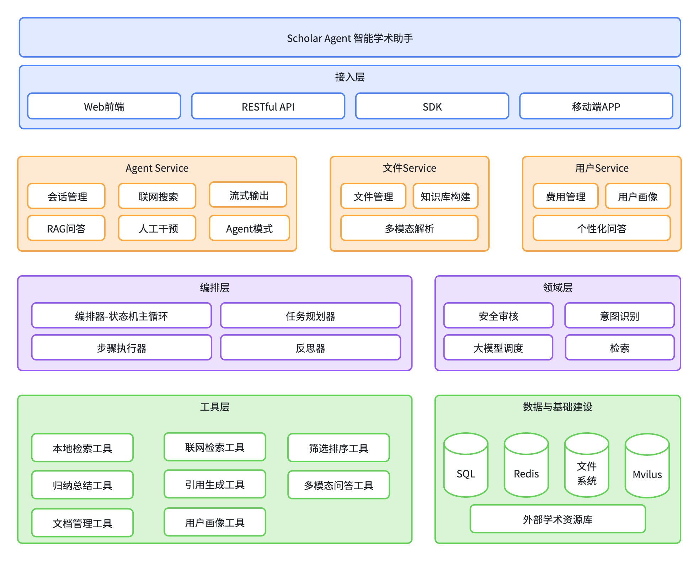

**层间请求流转说明**：

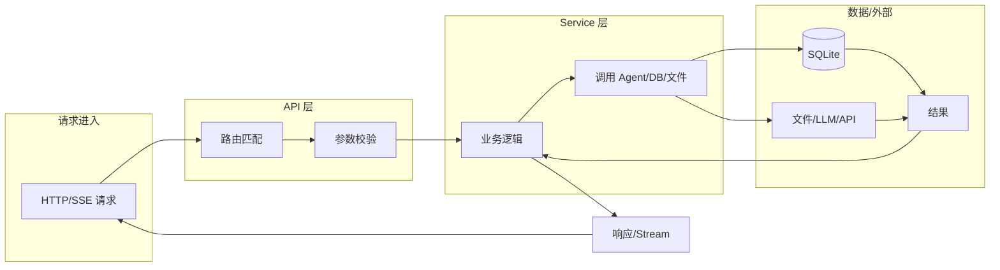
```mermaid
flowchart LR
    subgraph 请求进入
        R1[HTTP/SSE 请求]
    end
    subgraph L2["API 层"]
        R2[路由匹配]
        R3[参数校验]
        R2 --> R3
    end
    subgraph L3["Service 层"]
        R4[业务逻辑]
        R5[调用 Agent/DB/文件]
        R4 --> R5
    end
    subgraph L4["数据/外部"]
        R6[(SQLite)]
        R7[文件/LLM/API]
        R6 & R7 --> R8[结果]
    end
    R1 --> R2
    R3 --> R4
    R5 --> R6 & R7
    R8 --> R4
    R4 --> R9[响应/Stream]
    R9 --> R1
```

### 2.2 系统数据流图（请求-响应路径）

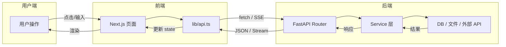
```mermaid
flowchart LR
    subgraph 用户端
        A[用户操作]
    end

    subgraph 前端
        B[Next.js 页面]
        C[lib/api.ts]
        B --> C
    end

    subgraph 后端
        D[FastAPI Router]
        E[Service 层]
        F[DB / 文件 / 外部 API]
        D --> E
        E --> F
    end

    A -->|"点击/输入"| B
    C -->|"fetch / SSE"| D
    F -->|"结果"| E
    E -->|"响应"| D
    D -->|"JSON / Stream"| C
    C -->|"更新 state"| B
    B -->|"渲染"| A
```

### 2.3 聊天请求完整时序图

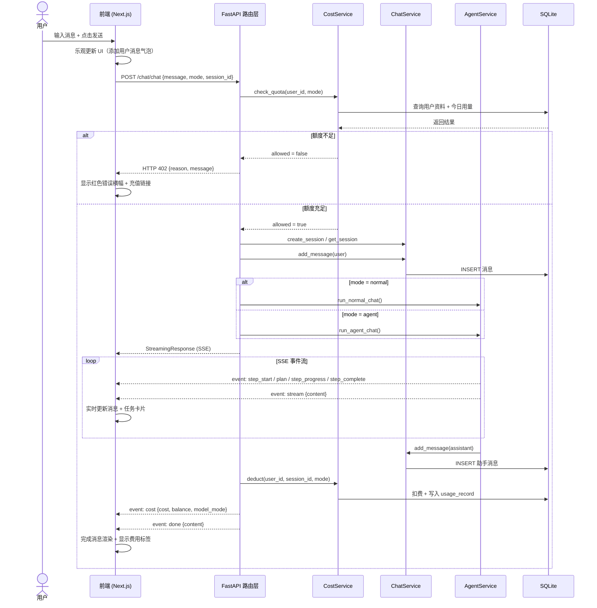
```mermaid
sequenceDiagram
    actor User as 用户
    participant FE as 前端 (Next.js)
    participant API as FastAPI 路由层
    participant Cost as CostService
    participant Chat as ChatService
    participant Agent as AgentService
    participant DB as SQLite

    User->>FE: 输入消息 + 点击发送
    FE->>FE: 乐观更新 UI（添加用户消息气泡）

    FE->>API: POST /chat/chat {message, mode, session_id}

    API->>Cost: check_quota(user_id, mode)
    Cost->>DB: 查询用户资料 + 今日用量
    DB-->>Cost: 返回结果

    alt 额度不足
        Cost-->>API: allowed = false
        API-->>FE: HTTP 402 {reason, message}
        FE->>FE: 显示红色错误横幅 + 充值链接
    else 额度充足
        Cost-->>API: allowed = true
        API->>Chat: create_session / get_session
        API->>Chat: add_message(user)
        Chat->>DB: INSERT 消息

        alt mode = normal
            API->>Agent: run_normal_chat()
        else mode = agent
            API->>Agent: run_agent_chat()
        end

        API-->>FE: StreamingResponse (SSE)

        loop SSE 事件流
            Agent-->>FE: event: step_start / plan / step_progress / step_complete
            Agent-->>FE: event: stream {content}
            FE->>FE: 实时更新消息 + 任务卡片
        end

        Agent->>Chat: add_message(assistant)
        Chat->>DB: INSERT 助手消息

        API->>Cost: deduct(user_id, session_id, mode)
        Cost->>DB: 扣费 + 写入 usage_record
        API-->>FE: event: cost {cost, balance, model_mode}
        API-->>FE: event: done {content}

        FE->>FE: 完成消息渲染 + 显示费用标签
    end
```

### 2.4 模块依赖关系图

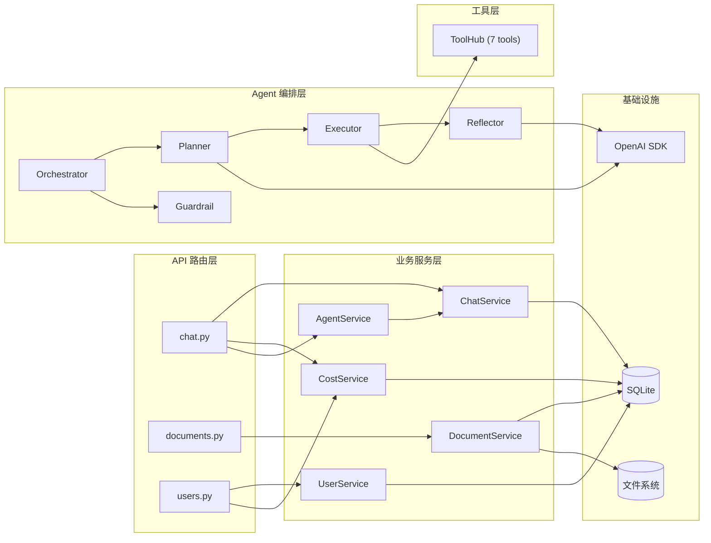
```mermaid
graph LR
    subgraph API["API 路由层"]
        chat_ep["chat.py"]
        doc_ep["documents.py"]
        user_ep["users.py"]
    end

    subgraph Services["业务服务层"]
        agent_svc["AgentService"]
        chat_svc["ChatService"]
        cost_svc["CostService"]
        doc_svc["DocumentService"]
        user_svc["UserService"]
    end

    subgraph Agent["Agent 编排层"]
        orchestrator["Orchestrator"]
        planner["Planner"]
        executor["Executor"]
        reflector["Reflector"]
        guardrail["Guardrail"]
    end

    subgraph Tools["工具层"]
        toolhub["ToolHub (7 tools)"]
    end

    subgraph Infra["基础设施"]
        db[("SQLite")]
        fs[("文件系统")]
        llm["OpenAI SDK"]
    end

    chat_ep --> chat_svc & cost_svc & agent_svc
    doc_ep --> doc_svc
    user_ep --> user_svc & cost_svc

    agent_svc --> chat_svc
    orchestrator --> planner --> executor --> reflector
    orchestrator --> guardrail
    executor --> toolhub

    chat_svc & doc_svc & user_svc & cost_svc --> db
    doc_svc --> fs
    planner & reflector --> llm
```

### 2.5 费用检查与扣费流程图

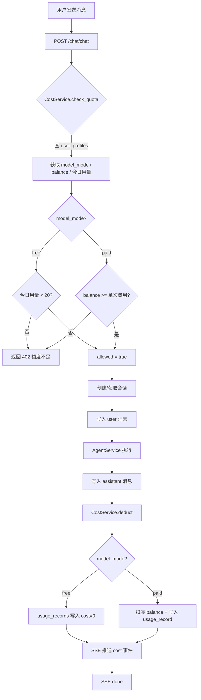
```mermaid
flowchart TD
    A[用户发送消息] --> B[POST /chat/chat]
    B --> C{CostService.check_quota}
    C -->|查 user_profiles| D[获取 model_mode / balance / 今日用量]
    D --> E{model_mode?}
    E -->|free| F{今日用量 < 20?}
    F -->|否| G[返回 402 额度不足]
    F -->|是| H[allowed = true]
    E -->|paid| I{balance >= 单次费用?}
    I -->|否| G
    I -->|是| H
    H --> J[创建/获取会话]
    J --> K[写入 user 消息]
    K --> L[AgentService 执行]
    L --> M[写入 assistant 消息]
    M --> N[CostService.deduct]
    N --> O{model_mode?}
    O -->|free| P[usage_records 写入 cost=0]
    O -->|paid| Q[扣减 balance + 写入 usage_record]
    P --> R[SSE 推送 cost 事件]
    Q --> R
    R --> S[SSE done]
```

### 2.6 费用检查与扣费时序图

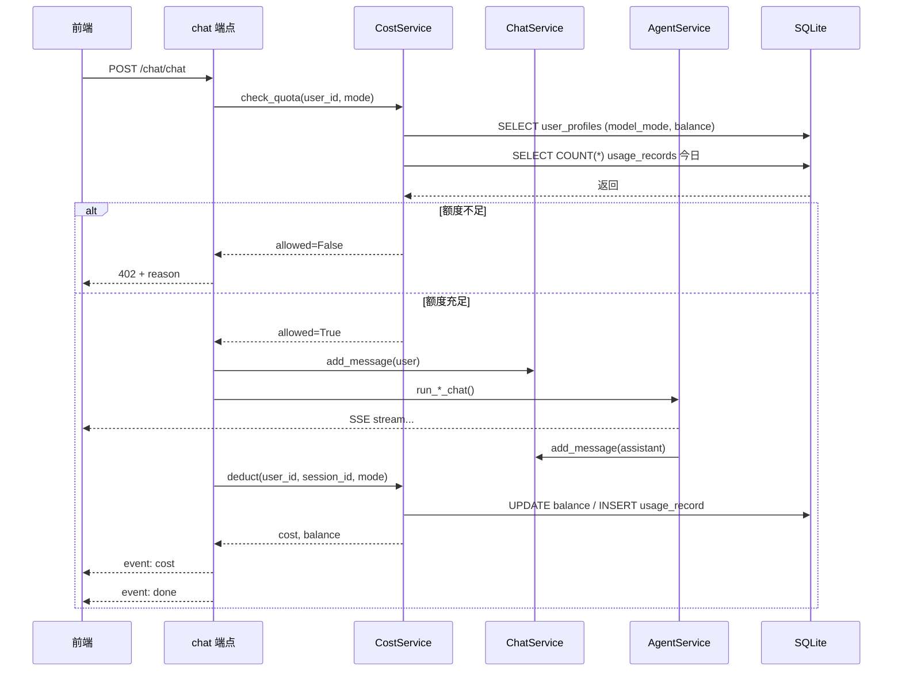
```mermaid
sequenceDiagram
    participant FE as 前端
    participant API as chat 端点
    participant Cost as CostService
    participant Chat as ChatService
    participant Agent as AgentService
    participant DB as SQLite

    FE->>API: POST /chat/chat
    API->>Cost: check_quota(user_id, mode)
    Cost->>DB: SELECT user_profiles (model_mode, balance)
    Cost->>DB: SELECT COUNT(*) usage_records 今日
    DB-->>Cost: 返回
    alt 额度不足
        Cost-->>API: allowed=False
        API-->>FE: 402 + reason
    else 额度充足
        Cost-->>API: allowed=True
        API->>Chat: add_message(user)
        API->>Agent: run_*_chat()
        Agent-->>FE: SSE stream...
        Agent->>Chat: add_message(assistant)
        API->>Cost: deduct(user_id, session_id, mode)
        Cost->>DB: UPDATE balance / INSERT usage_record
        Cost-->>API: cost, balance
        API-->>FE: event: cost
        API-->>FE: event: done
    end
```

### 2.7 文档上传流程图

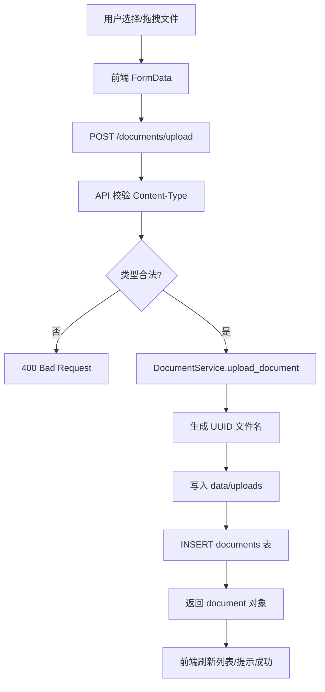
```mermaid
flowchart TD
    A[用户选择/拖拽文件] --> B[前端 FormData]
    B --> C[POST /documents/upload]
    C --> D[API 校验 Content-Type]
    D --> E{类型合法?}
    E -->|否| F[400 Bad Request]
    E -->|是| G[DocumentService.upload_document]
    G --> H[生成 UUID 文件名]
    H --> I[写入 data/uploads]
    I --> J[INSERT documents 表]
    J --> K[返回 document 对象]
    K --> L[前端刷新列表/提示成功]
```

### 2.8 文档上传时序图

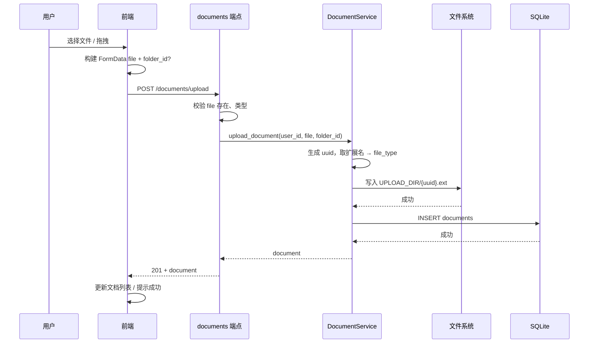
```mermaid
sequenceDiagram
    participant User as 用户
    participant FE as 前端
    participant API as documents 端点
    participant DocSvc as DocumentService
    participant FS as 文件系统
    participant DB as SQLite

    User->>FE: 选择文件 / 拖拽
    FE->>FE: 构建 FormData file + folder_id?
    FE->>API: POST /documents/upload
    API->>API: 校验 file 存在、类型
    API->>DocSvc: upload_document(user_id, file, folder_id)
    DocSvc->>DocSvc: 生成 uuid，取扩展名 → file_type
    DocSvc->>FS: 写入 UPLOAD_DIR/{uuid}.ext
    FS-->>DocSvc: 成功
    DocSvc->>DB: INSERT documents
    DB-->>DocSvc: 成功
    DocSvc-->>API: document
    API-->>FE: 201 + document
    FE->>FE: 更新文档列表 / 提示成功
```

### 2.9 Agent 模式执行流程图

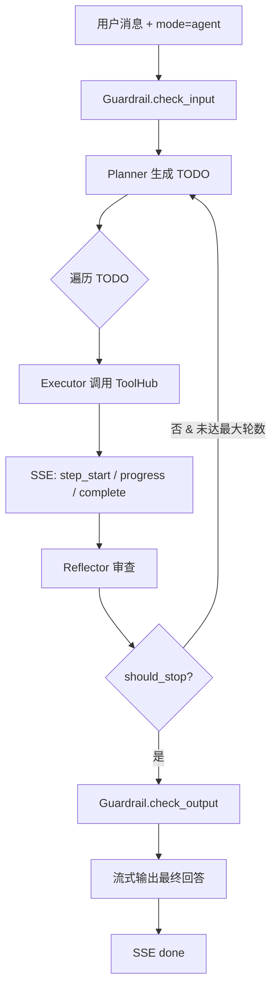
```mermaid
flowchart TD
    Start[用户消息 + mode=agent] --> GuardIn[Guardrail.check_input]
    GuardIn --> Plan[Planner 生成 TODO]
    Plan --> Loop{遍历 TODO}
    Loop --> Exec[Executor 调用 ToolHub]
    Exec --> StepOut[SSE: step_start / progress / complete]
    StepOut --> Reflect[Reflector 审查]
    Reflect --> Stop{should_stop?}
    Stop -->|否 & 未达最大轮数| Plan
    Stop -->|是| GuardOut[Guardrail.check_output]
    GuardOut --> Stream[流式输出最终回答]
    Stream --> Done[SSE done]
```

### 2.10 个人中心与充值流程图

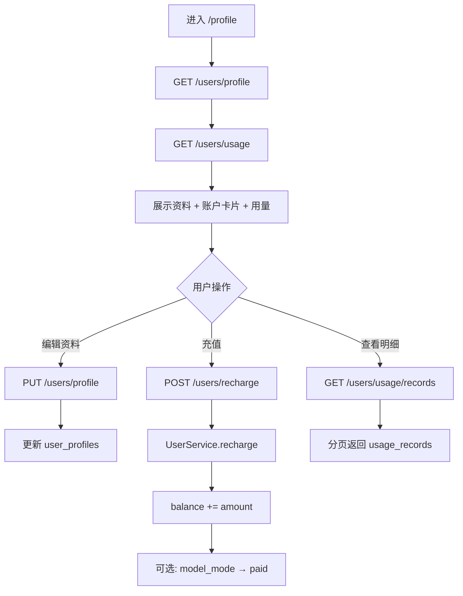
```mermaid
flowchart TD
    A[进入 /profile] --> B[GET /users/profile]
    B --> C[GET /users/usage]
    C --> D[展示资料 + 账户卡片 + 用量]
    D --> E{用户操作}
    E -->|编辑资料| F[PUT /users/profile]
    E -->|充值| G[POST /users/recharge]
    E -->|查看明细| H[GET /users/usage/records]
    F --> I[更新 user_profiles]
    G --> J[UserService.recharge]
    J --> K[balance += amount]
    K --> L[可选: model_mode → paid]
    H --> M[分页返回 usage_records]
```

### 2.11 会话管理流程图


```mermaid
flowchart TD
    subgraph 会话列表
        A1[进入聊天页/侧边栏] --> A2[GET /sessions]
        A2 --> A3[ChatService.list_sessions]
        A3 --> A4[(按 updated_at DESC)]
        A4 --> A5[前端渲染会话列表]
    end
    subgraph 新建会话
        B1[点击「新对话」] --> B2[POST /sessions 或 直接发首条消息]
        B2 --> B3{有无 session_id?}
        B3 -->|无| B4[ChatService.create_session]
        B3 -->|有| B5[ChatService.get_session]
        B4 --> B6[INSERT sessions]
        B5 --> B7[GET messages]
        B6 --> B8[返回 session_id]
    end
    subgraph 删除会话
        C1[点击删除] --> C2[DELETE /sessions/:id]
        C2 --> C3[ChatService.delete_session]
        C3 --> C4[DELETE messages 级联]
        C4 --> C5[DELETE session]
        C5 --> C6[前端从列表移除]
    end
```

### 2.12 会话管理时序图

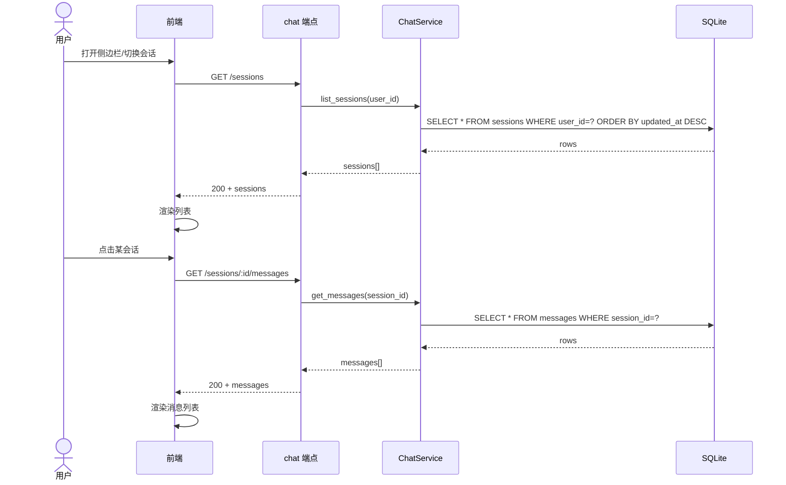
```mermaid
sequenceDiagram
    actor User as 用户
    participant FE as 前端
    participant API as chat 端点
    participant Chat as ChatService
    participant DB as SQLite

    User->>FE: 打开侧边栏/切换会话
    FE->>API: GET /sessions
    API->>Chat: list_sessions(user_id)
    Chat->>DB: SELECT * FROM sessions WHERE user_id=? ORDER BY updated_at DESC
    DB-->>Chat: rows
    Chat-->>API: sessions[]
    API-->>FE: 200 + sessions
    FE->>FE: 渲染列表

    User->>FE: 点击某会话
    FE->>API: GET /sessions/:id/messages
    API->>Chat: get_messages(session_id)
    Chat->>DB: SELECT * FROM messages WHERE session_id=?
    DB-->>Chat: rows
    Chat-->>API: messages[]
    API-->>FE: 200 + messages
    FE->>FE: 渲染消息列表
```

### 2.13 文档列表与文件夹筛选流程图

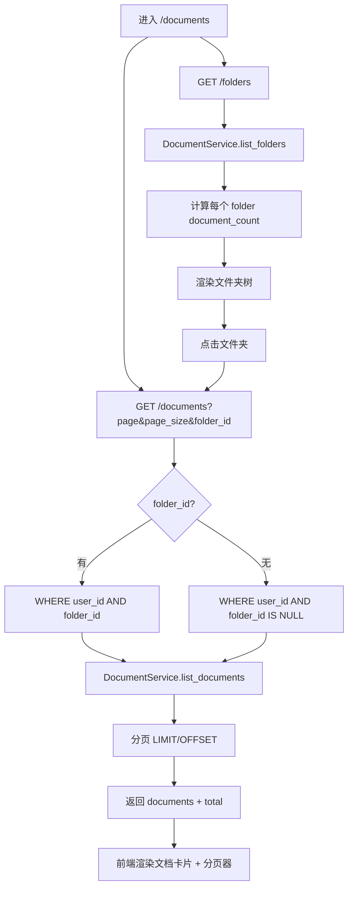
```mermaid
flowchart TD
    A[进入 /documents] --> B[GET /folders]
    B --> C[DocumentService.list_folders]
    C --> D[计算每个 folder document_count]
    D --> E[渲染文件夹树]
    A --> F[GET /documents?page&page_size&folder_id]
    F --> G{folder_id?}
    G -->|有| H[WHERE user_id AND folder_id]
    G -->|无| I[WHERE user_id AND folder_id IS NULL]
    H --> J[DocumentService.list_documents]
    I --> J
    J --> K[分页 LIMIT/OFFSET]
    K --> L[返回 documents + total]
    L --> M[前端渲染文档卡片 + 分页器]
    E --> N[点击文件夹]
    N --> F
```

### 2.14 文档删除与移动流程图


```mermaid
flowchart TD
    subgraph 删除文档
        D1[用户点击删除] --> D2[确认弹窗]
        D2 --> D3[DELETE /documents/:id]
        D3 --> D4[DocumentService.delete_document]
        D4 --> D5[DELETE FROM documents]
        D5 --> D6[删除物理文件 os.remove]
        D6 --> D7[前端从列表移除]
    end
    subgraph 移动文档
        M1[拖拽或选择目标文件夹] --> M2[PUT /documents/:id/move]
        M2 --> M3[body: folder_id]
        M3 --> M4[DocumentService.move_document]
        M4 --> M5[UPDATE documents SET folder_id=?]
        M5 --> M6[前端刷新列表]
    end
```

### 2.15 个人资料编辑与保存时序图

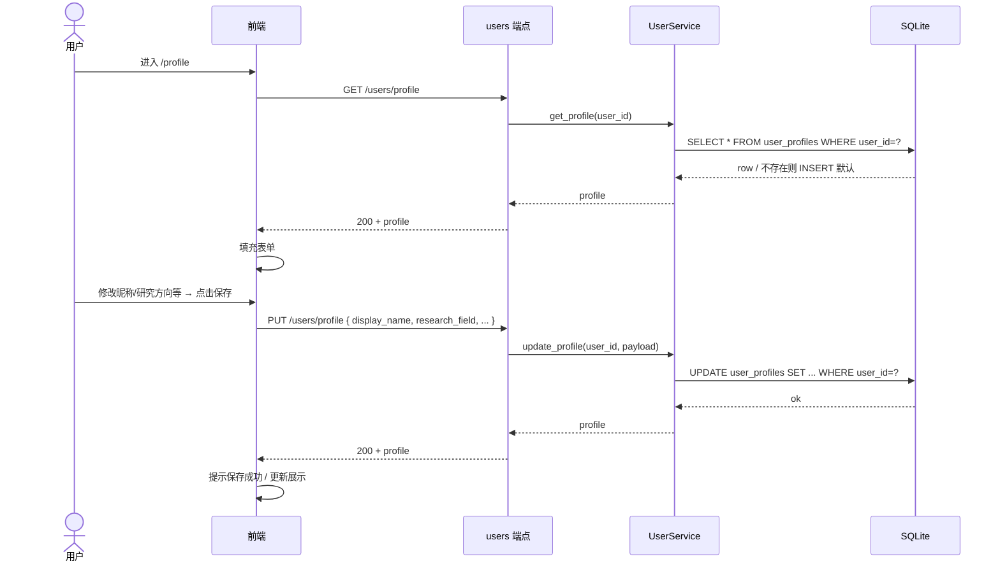
```mermaid
sequenceDiagram
    actor User as 用户
    participant FE as 前端
    participant API as users 端点
    participant UserSvc as UserService
    participant DB as SQLite

    User->>FE: 进入 /profile
    FE->>API: GET /users/profile
    API->>UserSvc: get_profile(user_id)
    UserSvc->>DB: SELECT * FROM user_profiles WHERE user_id=?
    DB-->>UserSvc: row / 不存在则 INSERT 默认
    UserSvc-->>API: profile
    API-->>FE: 200 + profile
    FE->>FE: 填充表单

    User->>FE: 修改昵称/研究方向等 → 点击保存
    FE->>API: PUT /users/profile { display_name, research_field, ... }
    API->>UserSvc: update_profile(user_id, payload)
    UserSvc->>DB: UPDATE user_profiles SET ... WHERE user_id=?
    DB-->>UserSvc: ok
    UserSvc-->>API: profile
    API-->>FE: 200 + profile
    FE->>FE: 提示保存成功 / 更新展示
```

### 2.16 充值流程时序图

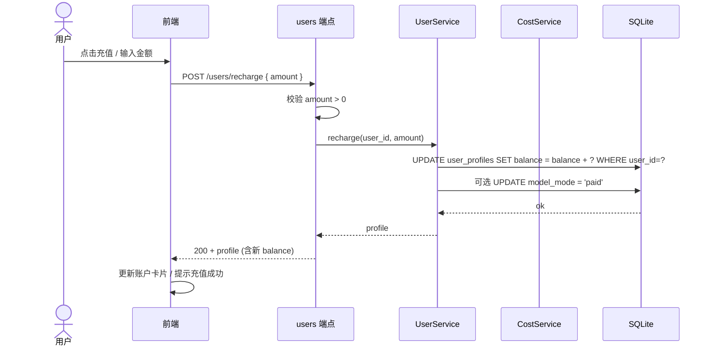
```mermaid
sequenceDiagram
    actor User as 用户
    participant FE as 前端
    participant API as users 端点
    participant UserSvc as UserService
    participant Cost as CostService
    participant DB as SQLite

    User->>FE: 点击充值 / 输入金额
    FE->>API: POST /users/recharge { amount }
    API->>API: 校验 amount > 0
    API->>UserSvc: recharge(user_id, amount)
    UserSvc->>DB: UPDATE user_profiles SET balance = balance + ? WHERE user_id=?
    UserSvc->>DB: 可选 UPDATE model_mode = 'paid'
    DB-->>UserSvc: ok
    UserSvc-->>API: profile
    API-->>FE: 200 + profile (含新 balance)
    FE->>FE: 更新账户卡片 / 提示充值成功
```

### 2.17 前端 SSE 解析与事件分发流程图

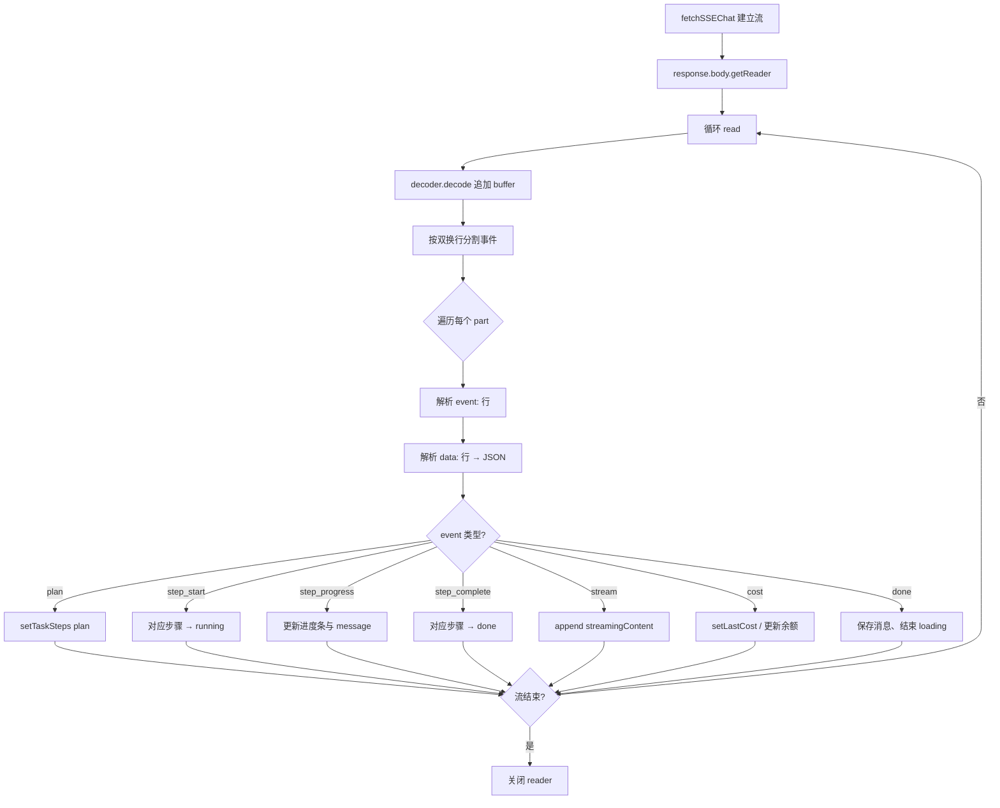
```mermaid
flowchart TD
    A[fetchSSEChat 建立流] --> B[response.body.getReader]
    B --> C[循环 read]
    C --> D[decoder.decode 追加 buffer]
    D --> E[按双换行分割事件]
    E --> F{遍历每个 part}
    F --> G[解析 event: 行]
    G --> H[解析 data: 行 → JSON]
    H --> I{event 类型?}
    I -->|plan| J[setTaskSteps plan]
    I -->|step_start| K[对应步骤 → running]
    I -->|step_progress| L[更新进度条与 message]
    I -->|step_complete| M[对应步骤 → done]
    I -->|stream| N[append streamingContent]
    I -->|cost| O[setLastCost / 更新余额]
    I -->|done| P[保存消息、结束 loading]
    J & K & L & M & N & O & P --> Q{流结束?}
    Q -->|否| C
    Q -->|是| R[关闭 reader]
```

### 2.18 用量统计时序图

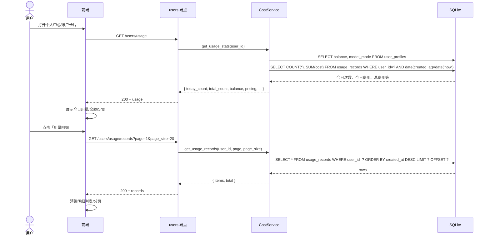
```mermaid
sequenceDiagram
    actor User as 用户
    participant FE as 前端
    participant API as users 端点
    participant Cost as CostService
    participant DB as SQLite

    User->>FE: 打开个人中心/账户卡片
    FE->>API: GET /users/usage
    API->>Cost: get_usage_stats(user_id)
    Cost->>DB: SELECT balance, model_mode FROM user_profiles
    Cost->>DB: SELECT COUNT(*), SUM(cost) FROM usage_records WHERE user_id=? AND date(created_at)=date('now')
    DB-->>Cost: 今日次数、今日费用、总费用等
    Cost-->>API: { today_count, total_count, balance, pricing, ... }
    API-->>FE: 200 + usage
    FE->>FE: 展示今日用量/余额/定价

    User->>FE: 点击「用量明细」
    FE->>API: GET /users/usage/records?page=1&page_size=20
    API->>Cost: get_usage_records(user_id, page, page_size)
    Cost->>DB: SELECT * FROM usage_records WHERE user_id=? ORDER BY created_at DESC LIMIT ? OFFSET ?
    DB-->>Cost: rows
    Cost-->>API: { items, total }
    API-->>FE: 200 + records
    FE->>FE: 渲染明细列表/分页
```

---

## 3. 后端详细设计

### 3.1 核心配置 (`app/core/config.py`)

通过环境变量或 `.env` 文件配置，由 Pydantic Settings 自动加载。

| 配置项 | 默认值 | 说明 |
|--------|--------|------|
| `DATABASE_PATH` | `data/scholar_agent.db` | SQLite 数据库路径 |
| `UPLOAD_DIR` | `data/uploads` | 上传文件存储目录 |
| `OPENAI_API_KEY` | `""` | OpenAI API 密钥（空则使用 Mock 模式） |
| `OPENAI_BASE_URL` | `""` | 自定义 API 地址（兼容 DeepSeek 等） |
| `OPENAI_MODEL` | `gpt-4o-mini` | 默认模型 |

**环境变量示例 (`.env`)**:
```env
OPENAI_API_KEY=sk-xxxx
OPENAI_BASE_URL=https://api.deepseek.com/v1
OPENAI_MODEL=deepseek-chat
```

### 3.2 数据库层 (`app/core/database.py`)

- 使用全局单例连接，`check_same_thread=False` 支持多线程
- 启用 WAL 模式（Write-Ahead Logging）提升并发读性能
- 启用外键约束
- 应用启动时自动建表（`CREATE TABLE IF NOT EXISTS`）

### 3.3 业务服务层

#### 3.3.1 ChatService (`app/services/chat_service.py`)

| 方法 | 功能 | 特殊逻辑 |
|------|------|---------|
| `create_session()` | 创建新会话 | 返回包含 UUID 的会话对象 |
| `get_session()` | 获取会话 | 返回 None 如果不存在 |
| `list_sessions()` | 列出用户所有会话 | 按 updated_at DESC 排序 |
| `delete_session()` | 删除会话 | 级联删除关联消息 |
| `add_message()` | 添加消息 | 首条 user 消息自动更新会话标题（取前 50 字） |
| `get_messages()` | 获取会话消息 | 按 created_at ASC 排序，自动解析 metadata_json |

#### 3.3.2 DocumentService (`app/services/document_service.py`)

| 方法 | 功能 | 特殊逻辑 |
|------|------|---------|
| `upload_document()` | 上传文档 | 文件保存到 `UPLOAD_DIR/{uuid}.ext`，扩展名映射 file_type |
| `list_documents()` | 分页查询文档 | 支持按 folder_id 筛选 |
| `delete_document()` | 删除文档 | 同时删除物理文件 |
| `move_document()` | 移动文档到文件夹 | 更新 folder_id |
| `create_folder()` | 创建文件夹 | 支持 parent_id 嵌套 |
| `list_folders()` | 列出文件夹 | 动态计算每个文件夹的 document_count |
| `delete_folder()` | 删除文件夹 | 文件夹内文档的 folder_id 置为 NULL（文档不删除） |

#### 3.3.3 UserService (`app/services/user_service.py`)

| 方法 | 功能 | 特殊逻辑 |
|------|------|---------|
| `get_profile()` | 获取用户资料 | 用户不存在时自动创建默认资料 |
| `update_profile()` | 更新资料 | 只更新非 null 字段，白名单过滤 |
| `recharge()` | 余额充值 | balance 累加，自动切换为 paid 模式 |

#### 3.3.4 AgentService (`app/services/agent_service.py`)

**核心职责**：接收用户消息，驱动 Agent 流程，生成 SSE 事件流。

| 函数 | 模式 | 流程 |
|------|------|------|
| `run_normal_chat()` | 普通模式 | step_start → stream（分块） → done |
| `run_agent_chat()` | 智能体模式 | plan → [step_start→progress→complete] ×4 → stream → done |

**当前状态**：
- 使用 Mock 数据（MOCK_PAPERS 列表）模拟检索
- 使用模板函数生成回答和摘要
- **待实现**：接入真实 LLM 和 arXiv API

#### 3.3.5 CostService (`app/services/cost_service.py`)

费用管理服务，负责额度检查、扣费和用量统计。

**计费规则**:

| 模式 | 类型 | 规则 |
|------|------|------|
| 免费模式 | 每日额度 | 20 次/天（普通+Agent 合计），按自然日重置 |
| 付费模式 | 普通对话 | ¥0.05/次，从余额扣除 |
| 付费模式 | Agent 对话 | ¥0.20/次，从余额扣除 |

| 方法 | 功能 | 特殊逻辑 |
|------|------|---------|
| `check_quota()` | 检查额度 | 免费模式查今日用量 vs 每日配额；付费模式查余额 vs 单次费用 |
| `deduct()` | 执行扣费 | 付费模式从余额扣除；记录 usage_record |
| `get_usage_stats()` | 费用统计 | 今日用量/总用量/余额/定价 |
| `get_usage_records()` | 用量明细 | 分页查询历史记录 |

**调用时机**:
- `chat` 接口发送前调用 `check_quota()` — 不通过返回 HTTP 402
- SSE 流结束后调用 `deduct()` — 执行扣费并推送 `cost` 事件

### 3.4 Agent 编排层

#### 3.4.1 整体流程

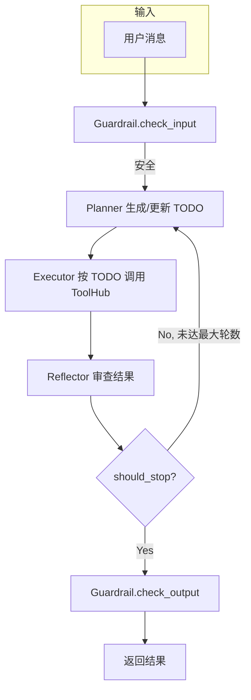
```mermaid
flowchart TB
    subgraph 输入
        IN[用户消息]
    end

    IN --> GuardIn[Guardrail.check_input]
    GuardIn -->|安全| Planner[Planner 生成/更新 TODO]
    Planner --> Executor[Executor 按 TODO 调用 ToolHub]
    Executor --> Reflector[Reflector 审查结果]
    Reflector --> Decision{should_stop?}
    Decision -->|No, 未达最大轮数| Planner
    Decision -->|Yes| GuardOut[Guardrail.check_output]
    GuardOut --> Out[返回结果]
```

**流程说明（与 ASCII 对照）**：

- **输入检查**：`Guardrail.check_input()` 通过则进入规划。
- **Planner**：生成/更新 TODO 列表（有 API Key 时 LLM 生成，否则规则模板 4 步）。
- **Executor**：按 TODO 逐步调用 ToolHub 中工具，收集结果到 context。
- **Reflector**：审查结果，输出 `should_stop`；为否且未达最大轮数则回到 Planner（最多 4 轮）。
- **输出检查**：`Guardrail.check_output()` 通过后返回最终结果。

#### 3.4.2 各组件详细设计

**Planner（规划器）**:
- 双模式：有 API Key 时用 LLM 生成计划，无则用规则模板
- 规则模板固定生成 4 步计划：检索 → 筛选 → 总结 → 引用
- LLM 模式使用 System Prompt 指导输出 JSON 格式计划
- 输入：用户目标 + 已有上下文
- 输出：TODO 列表 `[{id, action, tool, query, status}]`

**Executor（执行器）**:
- 遍历 TODO 列表，逐步调用 ToolHub 中对应工具
- 收集所有步骤结果到 context 字典
- 当前为串行执行，V1.0 可改为依赖分析后并行

**Reflector（反思器）**:
- 双模式：有 API Key 时用 LLM 判断结果质量，无则默认一轮即止
- 输出：`{should_stop: bool, summary: str, feedback: str}`

**Guardrail（安全护栏）**:
- 输入检查：正则匹配危险模式（SQL 注入、攻击关键词等）
- 输出检查：预留扩展点，当前直接放行
- 无外部依赖，纯规则实现

#### 3.4.3 ToolHub 工具注册

| 工具 | 类名 | 当前状态 | 待实现 |
|------|------|---------|--------|
| 学术检索 | SearchTool | Mock | 对接 arXiv API + Semantic Scholar API |
| 筛选排序 | FilterTool | Mock | 基于引用数/相关度的排序算法 |
| 归纳总结 | SummarizeTool | Mock | 调用 LLM 生成摘要 |
| 引用生成 | CitationTool | Mock | 格式化引用（GB/T 7714 / APA） |
| 多模态问答 | MultiModalRAGTool | Mock | 文档解析 + 向量检索 + LLM 问答 |
| 文档管理 | DocTool | Mock | 对接 DocumentService |
| 用户画像 | ProfileTool | Mock | 对接 UserService + 兴趣提取 |

**自定义工具扩展**：
```python
from app.tools.toolhub import BaseTool, toolhub

class MyTool(BaseTool):
    name = "MyTool"
    description = "我的自定义工具"

    def run(self, query: str) -> str:
        return "执行结果"

toolhub.register(MyTool())
```

### 3.5 API 层设计

| 路由前缀 | 文件 | 接口数 | 说明 |
|---------|------|--------|------|
| `/api/v1/chat` | `endpoints/chat.py` | 5 个 | 聊天 SSE + 会话 CRUD + 消息查询 |
| `/api/v1/documents` | `endpoints/documents.py` | 8 个 | 文档上传/列表/删除/移动 + 文件夹 CRUD |
| `/api/v1/users` | `endpoints/users.py` | 5 个 | 资料查询/更新 + 充值 + 费用统计/用量明细 |
| `/health` | `main.py` | 1 个 | 健康检查 |

> 详细接口规范见 [API 接口文档](./API接口文档.md)

---

## 4. 前端详细设计

### 4.1 页面路由

| 路由 | 页面文件 | 说明 |
|------|---------|------|
| `/` | `app/page.tsx` | 智能助手（主页），聊天界面 |
| `/documents` | `app/documents/page.tsx` | 文档管理 |
| `/profile` | `app/profile/page.tsx` | 个人中心 |

### 4.2 组件树

```
RootLayout (layout.tsx)
├── Navbar                          ← 所有页面共享
└── Page Content
    ├── ChatPage (/)
    │   ├── Sidebar                 ← 历史记录，可折叠
    │   ├── ChatMessage[]           ← 消息气泡列表
    │   ├── TaskProgress            ← Agent 任务进度卡片
    │   └── InputArea               ← 输入框 + 按钮 + 开关
    ├── DocumentsPage (/documents)
    │   ├── FolderSidebar           ← 文件夹列表
    │   ├── UploadArea              ← 拖拽/点击上传
    │   ├── SearchBar               ← 文档搜索
    │   ├── DocumentList            ← 文档卡片列表
    │   └── Pagination              ← 分页组件
    └── ProfilePage (/profile)
        ├── ProfileCard             ← 个人信息摘要
        ├── AccountCard             ← 账户信息
        ├── ProfileEditForm         ← 资料编辑表单
        └── ModelSettingsPanel      ← 模型设置 + 充值
```

### 4.3 状态管理

使用 React `useState` + 页面级状态，不引入全局状态管理库。

**ChatPage 核心状态**:
| 状态 | 类型 | 说明 |
|------|------|------|
| `messages` | `Msg[]` | 当前会话的消息列表 |
| `input` | `string` | 输入框内容 |
| `isLoading` | `boolean` | 是否等待回复 |
| `sessionId` | `string \| null` | 当前会话 ID |
| `mode` | `"normal" \| "agent"` | 对话模式 |
| `webSearch` | `boolean` | 联网搜索开关 |
| `taskSteps` | `TaskStep[]` | Agent 任务步骤列表 |
| `streamingContent` | `string` | 流式累积的内容 |
| `imagePreview` | `string \| null` | 待发送图片的 base64 |
| `lastCost` | `{cost: number, balance: number} \| null` | 最近一次对话的费用信息 |
| `costError` | `string \| null` | 余额不足错误提示 |

**聊天页状态与事件流转图**：

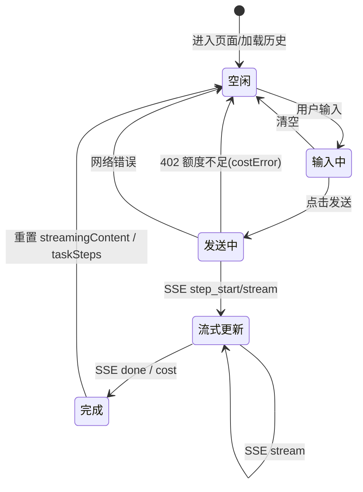
```mermaid
stateDiagram-v2
    [*] --> 空闲: 进入页面/加载历史
    空闲 --> 输入中: 用户输入
    输入中 --> 空闲: 清空
    输入中 --> 发送中: 点击发送
    发送中 --> 流式更新: SSE step_start/stream
    流式更新 --> 流式更新: SSE stream
    流式更新 --> 完成: SSE done / cost
    完成 --> 空闲: 重置 streamingContent / taskSteps
    发送中 --> 空闲: 402 额度不足(costError)
    发送中 --> 空闲: 网络错误
```

### 4.4 API 客户端 (`lib/api.ts`)

所有后端调用封装在 `lib/api.ts` 中，前端组件不直接使用 `fetch`。

| 函数 | 说明 |
|------|------|
| `fetchSSEChat()` | 核心：发送消息并解析 SSE 事件流 |
| `getSessions()` | 获取会话列表 |
| `createSession()` | 创建新会话 |
| `deleteSession()` | 删除会话 |
| `getMessages()` | 获取会话消息历史 |
| `uploadDocument()` | 上传文档（FormData） |
| `getDocuments()` | 分页获取文档列表 |
| `deleteDocument()` | 删除文档 |
| `createFolder()` | 创建文件夹 |
| `getFolders()` | 获取文件夹列表 |
| `deleteFolder()` | 删除文件夹 |
| `getProfile()` | 获取用户资料 |
| `updateProfile()` | 更新用户资料 |
| `recharge()` | 充值 |
| `getUsageStats()` | 获取费用统计 |
| `getUsageRecords()` | 分页获取用量记录 |

### 4.5 SSE 解析流程

```typescript
// 前端 SSE 解析核心逻辑
const reader = response.body.getReader();
const decoder = new TextDecoder();
let buffer = "";

while (true) {
  const { done, value } = await reader.read();
  if (done) break;
  buffer += decoder.decode(value, { stream: true });

  // 按 \n\n 分割事件
  const parts = buffer.split("\n\n");
  buffer = parts.pop() || "";  // 最后一段可能不完整，留在 buffer

  for (const part of parts) {
    // 解析 event: 和 data: 行
    // 根据 event type 分发处理（plan/step_start/stream/done 等）
  }
}
```

---

## 5. 数据库设计

### 5.1 ER 图

```mermaid
erDiagram
    sessions ||--o{ messages : "has"
    folders ||--o{ documents : "contains"
    folders ||--o{ folders : "parent"
    user_profiles ||--o{ sessions : "owns"
    user_profiles ||--o{ documents : "owns"
    user_profiles ||--o{ folders : "owns"
    user_profiles ||--o{ usage_records : "has"

    sessions {
        text id PK
        text user_id FK
        text title
        text mode
        text created_at
        text updated_at
    }

    messages {
        text id PK
        text session_id FK
        text role
        text content
        text msg_type
        text metadata_json
        text created_at
    }

    documents {
        text id PK
        text user_id FK
        text folder_id FK
        text filename
        text original_name
        text file_path
        int file_size
        text file_type
        text status
        text created_at
    }

    folders {
        text id PK
        text user_id FK
        text name
        text parent_id FK
        text created_at
    }

    user_profiles {
        text user_id PK
        text display_name
        text model_mode
        real balance
        text created_at
        text updated_at
    }

    usage_records {
        text id PK
        text user_id FK
        text session_id
        text mode
        real cost
        text created_at
    }
```

**关系说明**：

- `sessions` ──< `messages`：一对多，级联删除。
- `folders` ──< `documents`：一对多，删除文件夹时 `folder_id` 置 NULL。
- `folders` ──< `folders`：自引用，支持嵌套，级联删除。
- `user_profiles` 与 sessions、documents、folders、usage_records 均为用户维度关联。

### 5.2 表结构

#### sessions（会话）

| 字段 | 类型 | 约束 | 说明 |
|------|------|------|------|
| id | TEXT | PK | UUID |
| user_id | TEXT | NOT NULL, INDEX | 用户 ID |
| title | TEXT | NOT NULL | 会话标题（自动从首条消息提取） |
| mode | TEXT | NOT NULL | "normal" / "agent" |
| created_at | TEXT | NOT NULL | ISO8601 |
| updated_at | TEXT | NOT NULL | ISO8601，每条消息更新 |

#### messages（消息）

| 字段 | 类型 | 约束 | 说明 |
|------|------|------|------|
| id | TEXT | PK | UUID |
| session_id | TEXT | FK → sessions.id, INDEX | 所属会话 |
| role | TEXT | NOT NULL | "user" / "assistant" |
| content | TEXT | NOT NULL | 消息内容 |
| msg_type | TEXT | NOT NULL | "text"（扩展：image/file） |
| metadata_json | TEXT | NULLABLE | JSON 字符串，Agent 模式存 papers/citations |
| created_at | TEXT | NOT NULL | ISO8601 |

#### documents（文档）

| 字段 | 类型 | 约束 | 说明 |
|------|------|------|------|
| id | TEXT | PK | UUID |
| user_id | TEXT | NOT NULL, INDEX | 所属用户 |
| folder_id | TEXT | FK → folders.id, INDEX | 所属文件夹（可为 NULL） |
| filename | TEXT | NOT NULL | 存储文件名 `{uuid}.ext` |
| original_name | TEXT | NOT NULL | 原始文件名 |
| file_path | TEXT | NOT NULL | 服务器文件路径 |
| file_size | INTEGER | NOT NULL | 文件大小（字节） |
| file_type | TEXT | NOT NULL | pdf/word/markdown/text/other |
| page_count | INTEGER | DEFAULT 0 | 页数（V1.0 解析后填入） |
| status | TEXT | NOT NULL | uploaded/processing/ready/error |
| created_at | TEXT | NOT NULL | ISO8601 |

#### folders（文件夹）

| 字段 | 类型 | 约束 | 说明 |
|------|------|------|------|
| id | TEXT | PK | UUID |
| user_id | TEXT | NOT NULL, INDEX | 所属用户 |
| name | TEXT | NOT NULL | 文件夹名称 |
| parent_id | TEXT | FK → folders.id | 父文件夹（嵌套支持） |
| created_at | TEXT | NOT NULL | ISO8601 |

#### user_profiles（用户资料）

| 字段 | 类型 | 约束 | 说明 |
|------|------|------|------|
| user_id | TEXT | PK | 用户唯一标识 |
| display_name | TEXT | NOT NULL | 显示名称 |
| avatar_url | TEXT | | 头像 URL |
| research_field | TEXT | | 研究方向 |
| knowledge_level | TEXT | | beginner/intermediate/advanced |
| institution | TEXT | | 所属机构 |
| bio | TEXT | | 个人简介 |
| model_mode | TEXT | | free/paid |
| balance | REAL | DEFAULT 0.0 | 账户余额 |
| free_quota_today | INTEGER | DEFAULT 0 | 今日已用免费次数（旧字段，已改为实时查询） |
| free_quota_date | TEXT | | 免费额度日期 |
| created_at | TEXT | NOT NULL | ISO8601 |
| updated_at | TEXT | NOT NULL | ISO8601 |

#### usage_records（用量记录）

| 字段 | 类型 | 约束 | 说明 |
|------|------|------|------|
| id | TEXT | PK | UUID |
| user_id | TEXT | NOT NULL, INDEX | 用户 ID |
| session_id | TEXT | NULLABLE | 关联会话 |
| mode | TEXT | NOT NULL | "normal" / "agent" |
| cost | REAL | NOT NULL | 本次费用（元），免费模式为 0 |
| token_count | INTEGER | NOT NULL | Token 消耗数（预留） |
| created_at | TEXT | NOT NULL | ISO8601 |

### 5.3 索引

```sql
CREATE INDEX idx_sessions_user ON sessions(user_id);
CREATE INDEX idx_messages_session ON messages(session_id);
CREATE INDEX idx_documents_user ON documents(user_id);
CREATE INDEX idx_documents_folder ON documents(folder_id);
CREATE INDEX idx_folders_user ON folders(user_id);
CREATE INDEX idx_usage_user ON usage_records(user_id);
CREATE INDEX idx_usage_created ON usage_records(created_at);
```

---

## 6. Agent 核心流程

### 6.1 普通模式 (`run_normal_chat`)

```
输入: message, session_id, history
  │
  ├─ yield SSE: step_start (step_id="answer")
  ├─ 生成回答（LLM 或模板）
  ├─ 分块流式输出
  │   └─ yield SSE: stream × N
  ├─ 存储助手消息到 DB
  └─ yield SSE: done
```

**普通模式时序图**：

```mermaid
sequenceDiagram
    participant API as chat 端点
    participant Agent as AgentService
    participant Chat as ChatService
    participant LLM as OpenAI SDK
    participant DB as SQLite
    participant FE as 前端

    API->>Agent: run_normal_chat(message, session_id, history)
    Agent->>FE: SSE step_start(step_id=answer)
    Agent->>LLM: 流式调用 chat.completions.create
    loop 每 chunk
        LLM-->>Agent: delta content
        Agent->>FE: SSE stream { content }
    end
    Agent->>Chat: add_message(assistant, content)
    Chat->>DB: INSERT messages
    Agent->>FE: SSE done { content }
```

### 6.2 Agent 模式 (`run_agent_chat`)

```
输入: message, session_id, history, web_search
  │
  ├─ [规划阶段]
  │   ├─ yield SSE: step_start (step_id="plan")
  │   ├─ 生成 4 步计划
  │   └─ yield SSE: plan (todo_list)
  │
  ├─ [检索阶段] step_id="s1"
  │   ├─ yield SSE: step_start
  │   ├─ 调用 SearchTool（当前 Mock，待对接 arXiv）
  │   ├─ yield SSE: step_progress × 4 (20%, 50%, 80%, 100%)
  │   └─ yield SSE: step_complete (papers_found)
  │
  ├─ [筛选阶段] step_id="s2"
  │   ├─ yield SSE: step_start
  │   ├─ 按引用数排序，取 Top 4
  │   └─ yield SSE: step_complete (filtered_count)
  │
  ├─ [摘要阶段] step_id="s3"
  │   ├─ yield SSE: step_start
  │   ├─ 生成研究摘要（LLM 或模板）
  │   ├─ 分块流式输出
  │   │   └─ yield SSE: stream × N
  │   └─ yield SSE: step_complete (summary_length)
  │
  ├─ [引用阶段] step_id="s4"
  │   ├─ yield SSE: step_start
  │   ├─ 格式化引用列表
  │   ├─ yield SSE: stream (citations)
  │   └─ yield SSE: step_complete (citation_count)
  │
  ├─ 存储助手消息到 DB（含 metadata: papers + citations）
  └─ yield SSE: done
```

**Agent 模式详细时序图**：

```mermaid
sequenceDiagram
    participant API as chat 端点
    participant Agent as AgentService
    participant Orch as Orchestrator
    participant Plan as Planner
    participant Exec as Executor
    participant Refl as Reflector
    participant Tool as ToolHub
    participant Chat as ChatService
    participant FE as 前端

    API->>Agent: run_agent_chat(message, session_id, ...)
    Agent->>FE: SSE step_start(step_id=plan)
    Agent->>Orch: run(message)
    Orch->>Plan: 生成 TODO
    Plan-->>Orch: todo_list
    Agent->>FE: SSE plan { plan }

    loop 每个步骤 s1..s4
        Agent->>FE: SSE step_start(step_id=sN)
        Orch->>Exec: 执行 step
        Exec->>Tool: 调用 SearchTool/FilterTool/...
        Tool-->>Exec: 结果
        Agent->>FE: SSE step_progress / step_complete
        Orch->>Refl: 审查
        Refl-->>Orch: should_stop
    end

    Orch-->>Agent: 最终回答 + metadata
    Agent->>FE: SSE stream { content } × N
    Agent->>Chat: add_message(assistant, metadata)
    Agent->>FE: SSE done { content }
```

### 6.3 LLM 集成策略

```
配置了 OPENAI_API_KEY?
├── Yes → 使用 OpenAI SDK 调用 LLM
│         ├── Planner: LLM 生成 JSON 计划
│         ├── Normal Chat: LLM 流式回答
│         ├── Summarize: LLM 生成摘要
│         └── Reflector: LLM 判断质量
└── No  → 使用 Mock/规则模式
          ├── Planner: 返回固定 4 步模板
          ├── Normal Chat: 返回模板回答
          ├── Summarize: 返回模板摘要
          └── Reflector: 默认一轮即止
```

---

## 7. SSE 流式协议

### 7.1 服务端 SSE 生成流程

```mermaid
flowchart TD
    A[chat 端点收到 POST] --> B[check_quota → 402?]
    B -->|是| C[return 402]
    B -->|否| D[add_message user]
    D --> E{mode?}
    E -->|normal| F[run_normal_chat 生成器]
    E -->|agent| G[run_agent_chat 生成器]
    F --> H[step_start]
    G --> I[step_start plan → plan → step_start s1..s4...]
    H --> J[stream × N]
    I --> J
    J --> K[add_message assistant]
    K --> L[deduct 扣费]
    L --> M[yield cost 事件]
    M --> N[yield done 事件]
    N --> O[StreamingResponse 结束]
```

### 7.2 传输格式

```
event: {event_type}\n
data: {json_object}\n
\n
```

### 7.3 事件类型

| 事件 | data 字段 | 前端处理 |
|------|----------|---------|
| `plan` | `{plan: [{id, action, tool, status}]}` | 渲染 TaskProgress 卡片 |
| `step_start` | `{step_id, action}` | 对应步骤变为 running |
| `step_progress` | `{step_id, progress(0~1), message}` | 更新进度条和文字 |
| `step_complete` | `{step_id, result}` | 对应步骤变为 done |
| `stream` | `{content}` | 累加到 streamingContent |
| `done` | `{content}` | 保存为 assistant 消息，结束 loading |
| `cost` | `{cost, balance, model_mode}` | 更新前端余额显示 |

> 所有事件的 data 中均包含 `timestamp` 字段（ISO8601）。

---

## 8. 分阶段开发计划

### 8.1 MVP（3-4 周）

> 目标：可运行的端到端 Demo，使用 Mock 数据模拟 Agent 流程。

| 周 | 任务 | 产出 |
|----|------|------|
| **W1** | 后端骨架 + 数据库 + 基础 API | FastAPI 启动，SQLite 建表，CRUD 接口可用 |
| **W1** | Agent 编排框架 + Mock 工具 | Orchestrator/Planner/Executor/Reflector 可运行 |
| **W2** | SSE 流式接口 + Agent 模式 | chat 接口返回完整 SSE 流 |
| **W2** | 前端聊天页 + 侧边栏 | 消息收发、流式渲染、历史记录 |
| **W3** | 前端文档管理页 + 个人中心页 | 上传/文件夹/分页、资料编辑/充值 |
| **W3** | 联调 + Bug 修复 + 部署 | 全链路跑通，可公开演示 |

**MVP 已完成清单** ✅：
- [x] FastAPI 后端（19 个 API）
- [x] SQLite 数据库（6 张表 + 7 个索引）
- [x] Agent 编排层（Orchestrator + Planner + Executor + Reflector + Guardrail）
- [x] ToolHub（7 个工具，Mock 实现）
- [x] SSE 流式输出（7 种事件类型）
- [x] 前端 3 个页面（聊天/文档/个人中心）
- [x] 前端 4 个组件（Navbar/Sidebar/ChatMessage/TaskProgress）
- [x] 费用管理（CostService + 额度检查 + 扣费 + 用量统计）

### 8.2 V1.0（4-6 周）

> 目标：接入真实 LLM 和学术 API，实现多模态 RAG。

| 周 | 任务 | 详细说明 |
|----|------|---------|
| **W4-5** | 接入 LLM | Planner/Reflector 用 LLM 生成，Normal Chat 用 LLM 流式回答 |
| **W4-5** | 接入 arXiv API | SearchTool 对接 arXiv API，实现真实学术检索 |
| **W5-6** | 文档解析 | PDF 解析为结构化文本，提取标题/摘要/章节 |
| **W6-7** | 向量检索 | BGE-M3 嵌入 + numpy 内存索引，实现语义搜索 |
| **W7-8** | 多模态 RAG | 图像/表格提取 + CLIP 嵌入 + 三路召回 |
| **W8-9** | SummarizeTool 实现 | 基于检索结果调用 LLM 生成结构化摘要 |
| **W9** | 可观测性 | 全链路 trace_id + Token 成本追踪 |

**V1.0 关键技术点**：

```
文档解析管线:
PDF → PyMuPDF 提取页面 → 文本/图像/表格分离
    → 文本 chunk（500 tokens，100 overlap）
    → BGE-M3 嵌入 → 存入向量索引
    → 图像 → CLIP 嵌入 → 存入向量索引

检索管线（三路召回）:
Query → BGE-M3 嵌入 → 文字-文字 检索 ─┐
     → CLIP 嵌入   → 文字-图像 检索  ─┤→ RRF 合并 → Cross-Encoder 重排 → Top K
     → 关键词       → BM25 检索     ─┘
```

### 8.3 V2.0（4-6 周）

> 目标：Human-In-The-Loop + 个性化推荐。

| 周 | 任务 | 详细说明 |
|----|------|---------|
| **W10-11** | HITL 前端 | 计划编辑 UI + 文献筛选 UI |
| **W10-11** | HITL 后端 | SSE 暂停/恢复机制 + 用户确认 API |
| **W12-13** | 用户画像 | 行为日志收集 + 兴趣提取 + 画像生成 |
| **W13-14** | 个性化推荐 | 基于画像的论文推荐 + 推荐解释 |
| **W14-15** | 多 Agent 协作 | 检索 Agent + 摘要 Agent + 校验 Agent 并行 |

---

## 9. 部署与运维

### 9.1 本地开发

```bash
# 后端
cd backend
pip install -r requirements.txt
cp .env.example .env  # 填入 OPENAI_API_KEY（可选）
PYTHONPATH=. uvicorn main:app --host 0.0.0.0 --port 8001 --reload

# 前端
cd frontend
npm install
npm run dev  # 默认 http://localhost:3000
```

### 9.2 生产部署（Docker Compose）

```yaml
# docker-compose.yml（参考方案）
version: "3.8"
services:
  backend:
    build: ./backend
    ports:
      - "8001:8001"
    volumes:
      - ./data:/app/data
    environment:
      - OPENAI_API_KEY=${OPENAI_API_KEY}
      - OPENAI_BASE_URL=${OPENAI_BASE_URL}
      - OPENAI_MODEL=${OPENAI_MODEL}

  frontend:
    build: ./frontend
    ports:
      - "3000:3000"
    environment:
      - NEXT_PUBLIC_API_BASE=http://backend:8001/api/v1
    depends_on:
      - backend
```

### 9.3 环境变量清单

| 变量 | 必填 | 默认值 | 说明 |
|------|------|--------|------|
| `OPENAI_API_KEY` | 否 | `""` | 空则使用 Mock 模式 |
| `OPENAI_BASE_URL` | 否 | `""` | 自定义 API 端点 |
| `OPENAI_MODEL` | 否 | `gpt-4o-mini` | LLM 模型名 |

---

## 10. 开发规范

### 10.1 后端规范

| 规则 | 说明 |
|------|------|
| 代码风格 | PEP 8，行宽 120 |
| 类型标注 | 所有函数签名必须有类型标注 |
| 文档字符串 | 每个模块和公开方法必须有中文 docstring |
| 异常处理 | Service 层捕获异常，API 层转换为 HTTPException |
| 数据库操作 | 所有 SQL 使用参数化查询（`?` 占位符），禁止字符串拼接 |
| 依赖注入 | Service 实例化为模块级单例，通过 import 使用 |
| 新增工具 | 继承 `BaseTool`，注册到 `ToolHub`，不修改 Executor |

### 10.2 前端规范

| 规则 | 说明 |
|------|------|
| 代码风格 | ESLint + Prettier |
| 组件 | 函数组件 + Hooks，禁止 Class 组件 |
| 类型 | 所有 Props 定义 TypeScript Interface |
| 状态管理 | 页面级 useState，不引入全局状态库 |
| API 调用 | 统一通过 `lib/api.ts`，组件不直接 fetch |
| 样式 | Tailwind CSS 原子类，不写自定义 CSS（globals.css 除外） |
| 命名 | 组件 PascalCase，工具函数 camelCase，CSS class 用 Tailwind |

### 10.3 目录约定

| 新增内容 | 放置位置 | 说明 |
|---------|---------|------|
| 新 API 端点 | `backend/app/api/api_v1/endpoints/` | 新建文件，注册到 `api.py` |
| 新 Service | `backend/app/services/` | 新建文件，模块级单例 |
| 新工具 | `backend/app/tools/toolhub.py` | 新建类，注册到 `_register_defaults` |
| 新前端页面 | `frontend/app/{route}/page.tsx` | Next.js App Router 约定 |
| 新前端组件 | `frontend/components/` | PascalCase 命名 |
