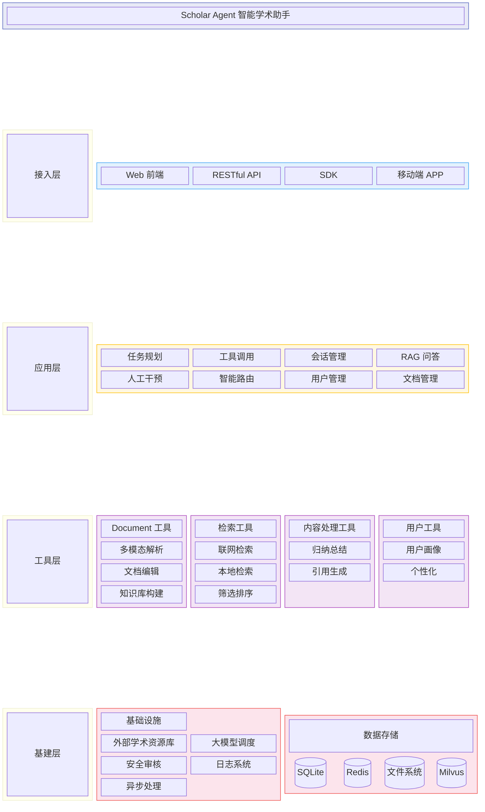
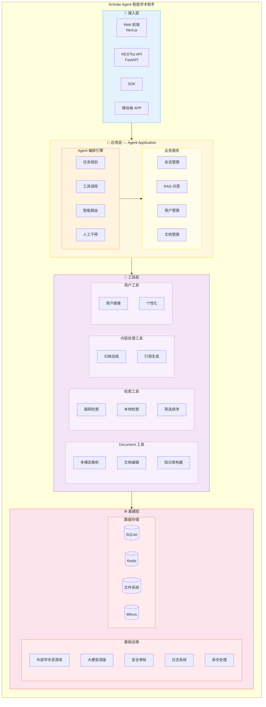
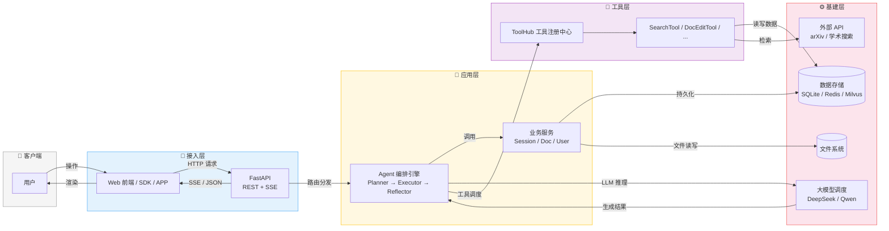
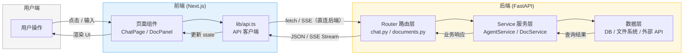
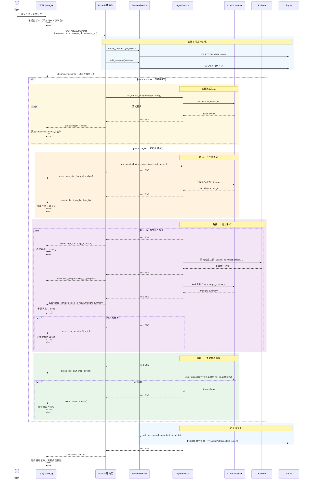
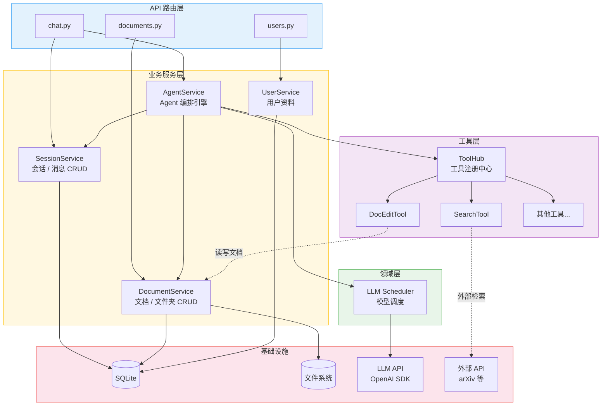
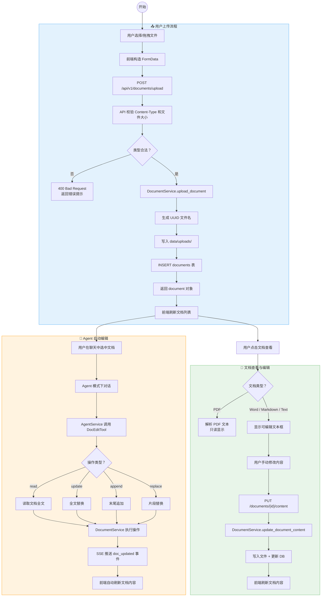
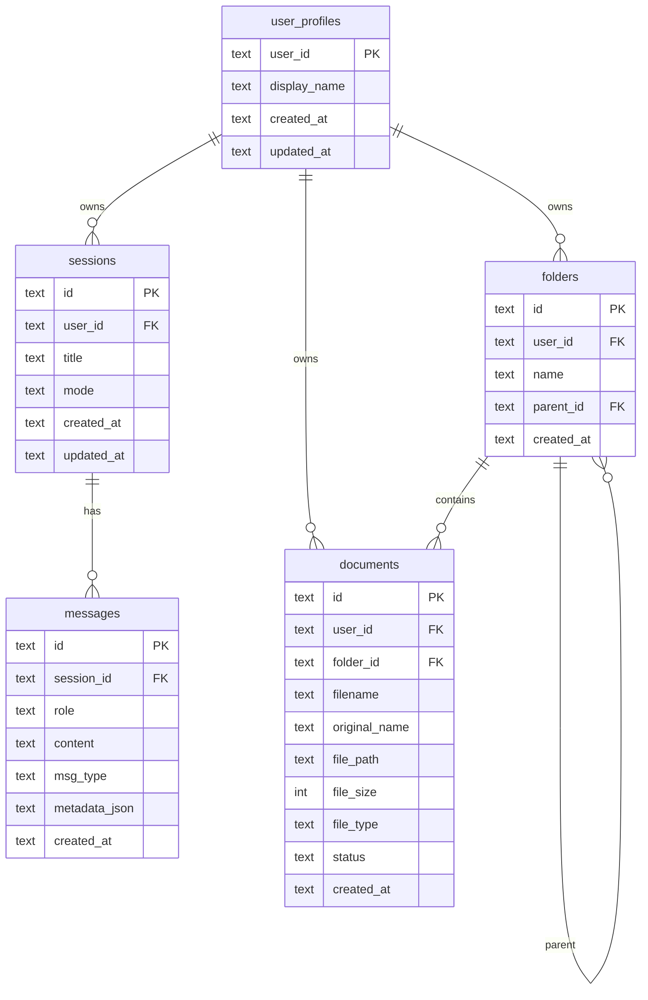
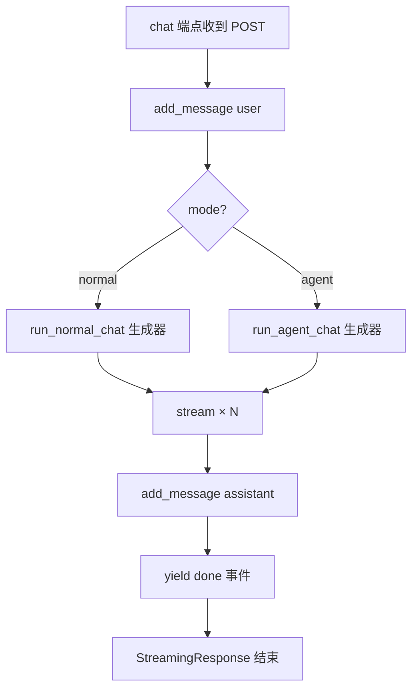

# Scholar Agent 技术开发方案

> 版本: v1.2 | 更新日期: 2026-02-16
>
> 关联文档: [PRD](./产品需求文档.md) · [API 接口文档](./API接口文档.md) · [前端交互文档](./前端交互文档.md)

---

## 目录

1. [项目总览](#1-项目总览)
2. [系统架构](#2-系统架构)
3. [后端详细设计](#3-后端详细设计)
4. [前端详细设计](#4-前端详细设计)
5. [数据库设计](#5-数据库设计)
6. [Agent 核心流程](#6-agent-核心流程)
7. [SSE 流式协议](#7-sse-流式协议)
8. [开发规范](#8-开发规范)

---

## 1. 项目总览

### 1.1 项目信息

| 属性 | 内容 |
|------|------|
| 项目名称 | Scholar Agent（智能学术助手） |
| 后端框架 | Python 3.10+ / FastAPI |
| 前端框架 | Next.js 14 / TypeScript / Tailwind CSS |
| Agent 编排 | 自研 Agent 流程 |
| LLM 接入 | 支持 DeepSeek 、千问等不同的模型接入 |
| 数据存储 | SQLite |
| 文件存储 | 本地文件系统 |

---

## 2. 系统架构

### 2.1 系统分层架构图（总览）



> **备注**：如果 Mermaid Block Diagram 不被渲染环境支持，可参考下方替代版本。

**替代版（flowchart 方式）**：



### 2.2 架构图详细说明

系统架构分为四层：接入层、应用层、工具层、基建层。应用层进一步划分为 **Agent 编排引擎**（核心调度）和**业务服务**（领域逻辑）两个子层。

---

#### 2.2.1 接入层

| 组件 | 说明 | 状态 |
|------|------|------|
| **Web 前端** | Next.js 页面，lib/api.ts 调用后端 | ✅ 已有 |
| **RESTful API** | FastAPI 路由，HTTP/SSE 协议 | ✅ 已有 |
| **SDK** | 第三方集成用 SDK | 📅 规划中 |
| **移动端 APP** | 原生移动应用 | 📅 规划中 |

---

#### 2.2.2 应用层（Agent Application）

| 子层 | 模块 | 职责 | 说明 |
|------|------|------|------|
| **Agent 编排引擎** | 任务规划 | 将用户复杂目标拆分为可执行 TODO 列表 | ✅ Agent Service |
| | 工具调用 | 协调调用各工具完成任务 | ✅ Agent Service |
| | 智能路由 | 根据任务类型选择最优处理路径 | 📅 V2.0 |
| | 人工干预 | 关键节点支持人工确认和修改 | 📅 V2.0 |
| **业务服务** | 会话管理 | 会话 CRUD、上下文管理 | ✅ SessionService |
| | RAG 问答 | 基于多模态的检索增强问答 | 📅 V1.0 |
| | 用户管理 | 用户资料、用户画像 | ✅ UserService |
| | 文档管理 | 文件管理、知识库构建 | ✅ DocumentService |

---

#### 2.2.3 工具层

| 工具分类 | 工具 | 说明 |
|---------|------|------|
| **Document 工具** | 多模态解析 | PDF/Word/图片等文档解析 |
| | 文档编辑 | 在线编辑文档内容 |
| | 知识库构建 | 文档索引与知识库建立 |
| **检索工具** | 联网检索 | arXiv、学术搜索引擎等 |
| | 本地检索 | 本地文档库检索 |
| | 筛选排序 | 结果筛选与排序 |
| **内容处理工具** | 归纳总结 | 文献归纳总结 |
| | 引用生成 | 自动生成引用格式 |
| **用户工具** | 用户画像 | 构建用户研究兴趣画像 |
| | 个性化 | 个性化推荐与内容适配 |

---

#### 2.2.4 基建层

##### 基础设施

| 组件 | 说明 | 状态 |
|------|------|------|
| **外部学术资源库** | arXiv、学术搜索引擎等外部 API | ✅ 已有 |
| **大模型调度** | LLM 调用（DeepSeek、千问等） | ✅ 已有 |
| **安全审核** | 内容安全、输入输出审核 | 📅 规划中 |
| **日志系统** | 应用日志、错误日志 | ✅ 已有 |
| **异步处理** | 异步任务处理 | 📅 规划中 |

##### 数据存储

| 组件 | 说明 | 状态 |
|------|------|------|
| **SQLite** | 关系型存储（会话、消息、文档、用户等） | ✅ 当前 |
| **Redis** | 缓存、会话、异步队列 | 📅 规划中 |
| **文件系统** | 上传文件存储 | ✅ 已有 |
| **Milvus** | 向量检索数据库 | 📅 V1.0 |

### 2.3 层间请求流转图



### 2.4 系统数据流图（请求-响应路径）



### 2.5 聊天请求完整时序图



### 2.6 模块依赖关系图



### 2.7 文档上传与编辑流程图



---

## 3. 后端详细设计

### 3.1 核心配置 (`app/core/config.py`)

通过环境变量或 `.env` 文件配置，由 Pydantic Settings 自动加载。

| 配置项 | 默认值 | 说明 |
|--------|--------|------|
| `DATABASE_PATH` | `data/scholar_agent.db` | SQLite 数据库路径 |
| `UPLOAD_DIR` | `data/uploads` | 上传文件存储目录 |
| `OPENAI_API_KEY` | `""` | OpenAI API 密钥 |
| `OPENAI_BASE_URL` | `""` | 自定义 API 地址（兼容 DeepSeek 等） |
| `OPENAI_MODEL` | `deepseek-chat` | 默认模型 |
| `BACKEND_PORT` | `8088` | 后端服务端口 |

**环境变量示例 (`.env`)**:
```env
OPENAI_API_KEY=sk-xxxx
OPENAI_BASE_URL=https://api.deepseek.com/v1
OPENAI_MODEL=deepseek-chat
```

### 3.2 数据库层 (`app/core/database.py`)

- 使用全局单例连接，`check_same_thread=False` 支持多线程
- 启用 WAL 模式（Write-Ahead Logging）提升并发读性能
- 启用外键约束
- 应用启动时自动建表（`CREATE TABLE IF NOT EXISTS`）

### 3.3 业务服务层

#### 3.3.1 SessionService (`app/services/agent_service.py` 内）

| 方法 | 功能 | 特殊逻辑 |
|------|------|---------|
| `create_session()` | 创建新会话 | 返回包含 UUID 的会话对象 |
| `get_session()` | 获取会话 | 返回 None 如果不存在 |
| `list_sessions()` | 列出用户所有会话 | 按 updated_at DESC 排序 |
| `delete_session()` | 删除会话 | 级联删除关联消息 |
| `add_message()` | 添加消息 | 首条 user 消息自动更新会话标题（取前 50 字） |
| `get_messages()` | 获取会话消息 | 按 created_at ASC 排序，自动解析 metadata_json |

#### 3.3.2 DocumentService (`app/services/document_service.py`)

| 方法 | 功能 | 特殊逻辑 |
|------|------|---------|
| `upload_document()` | 上传文档 | 文件保存到 `UPLOAD_DIR/{uuid}.ext`，扩展名映射 file_type |
| `list_documents()` | 分页查询文档 | 支持按 folder_id 筛选 |
| `get_document()` | 获取文档详情 | |
| `delete_document()` | 删除文档 | 同时删除物理文件 |
| `move_document()` | 移动文档到文件夹 | 更新 folder_id |
| `create_folder()` | 创建文件夹 | 支持 parent_id 嵌套 |
| `list_folders()` | 列出文件夹 | 动态计算每个文件夹的 document_count |
| `delete_folder()` | 删除文件夹 | 文件夹内文档的 folder_id 置为 NULL（文档不删除） |
| `get_document_content()` | 获取文档内容 | 支持 PDF/Word/Markdown/Text 解析 |
| `update_document_content()` | 更新文档内容 | 支持 Word/Markdown/Text 格式写入 |
| `append_document_content()` | 追加文档内容 | |
| `replace_document_content()` | 替换文档内容 | |

#### 3.3.3 UserService (`app/services/user_service.py`)

| 方法 | 功能 | 特殊逻辑 |
|------|------|---------|
| `get_profile()` | 获取用户资料 | 用户不存在时自动创建默认资料 |
| `update_profile()` | 更新资料 | 只更新非 null 字段 |

#### 3.3.4 AgentService (`app/services/agent_service.py`)

**核心职责**：接收用户消息，驱动 Agent 流程，生成 SSE 事件流。

| 函数 | 模式 | 流程 |
|------|------|------|
| `run_normal_chat()` | 普通模式 | stream（分块）→ done |
| `run_agent_chat()` | 智能体模式 | plan（含 thought） → [step_start→progress→complete（含 thought_summary）] × N → stream → done |

**SSE 事件生成**:
```python
def _sse(self, event_type: str, data: dict) -> str:
    data["timestamp"] = datetime.now(timezone.utc).isoformat()
    return f"event: {event_type}\ndata: {json.dumps(data, ensure_ascii=False)}\n\n"
```

**Agent 模式特点**：
- 使用 LLM 动态生成执行计划（包含 thought 字段）
- 支持动态步骤
- 支持文档编辑（DocEditTool）
- 文档编辑后发送 doc_updated 事件

#### 3.3.5 LLMScheduler (`app/domain/llm_scheduler/`)

**核心职责**：统一的 LLM 调用接口，支持多提供商

| 提供商 | 文件 | 说明 |
|--------|------|------|
| DeepSeek | `models/deepseek.py` | DeepSeek 模型集成 |
| 通义千问 | `models/qwen.py` | 通义千问模型集成 |

**服务方法**：
- `chat()`: 非流式返回
- `chat_stream()`: 流式对话

### 3.4 ToolHub 工具层

#### 3.4.1 工具注册

| 工具 | 说明 | 当前状态 |
|------|------|---------|
| SearchTool | 学术检索 | 已实现 |
| MultiModalRAGTool | 基于上传文档进行多模态问答 | 预留 |
| SummarizeTool | 对检索结果进行归纳总结 | 预留 |
| FilterTool | 筛选与排序检索结果 | 预留 |
| CitationTool | 自动生成引用格式 | 预留 |
| DocTool | 文档管理工具 | 预留 |
| DocEditTool | 文档内容编辑（支持word/markdown/text） | 已实现 |
| ProfileTool | 用户画像工具 | 预留 |

**DocEditTool 功能**：
- `read(doc_id)`: 读取文档全文
- `update(doc_id, content)`: 全文替换
- `append(doc_id, content)`: 末尾追加内容
- `replace(doc_id, old_text, new_text)`: 替换指定片段
- **支持格式**：.docx/.doc (word)、.md (markdown)、.txt (text)

**其他工具说明**：
- `SearchTool`: 学术检索，支持关键词、最大返回数、年份范围筛选
- `MultiModalRAGTool`: 基于上传文档进行多模态问答（预留）
- `SummarizeTool`: 对检索结果进行归纳总结（预留）
- `FilterTool`: 筛选与排序检索结果（预留）
- `CitationTool`: 自动生成引用格式（预留）
- `DocTool`: 文档管理工具（预留）
- `ProfileTool`: 用户画像工具（预留）

### 3.5 API 层设计

| 路由前缀 | 文件 | 接口数 | 说明 |
|---------|------|--------|------|
| `/api/v1/chat` | `endpoints/chat.py` | 5 个 | 聊天 SSE + 会话 CRUD + 消息查询 |
| `/api/v1/documents` | `endpoints/documents.py` | 10 个 | 文档上传/列表/删除/移动 + 文件夹 CRUD + 内容读写 |
| `/api/v1/users` | `endpoints/users.py` | 2 个 | 资料查询/更新 |
| `/health` | `server.py` | 1 个 | 健康检查 |

> 详细接口规范见 [API 接口文档](./API接口文档.md)

---

## 4. 前端详细设计

### 4.1 页面路由

| 路由 | 页面文件 | 说明 |
|------|---------|------|
| `/` | `app/page.tsx` | 智能助手（主页），集成聊天、文档管理、文档编辑 |
| `/profile` | `app/profile/page.tsx` | 个人中心 |

### 4.2 组件树

```
RootLayout (layout.tsx)
├── Navbar                          ← 所有页面共享
└── Page Content
    └── ChatPage (/)
        ├── Sidebar                 ← 历史记录
        ├── PaperPanel              ← 论文管理（可拖拽调整宽度）
        │   ├── FolderList         ← 文件夹列表
        │   ├── UploadArea        ← 上传区域
        │   ├── DocumentList      ← 文档列表
        │   └── Pagination         ← 分页
        ├── DocContentPanel           ← 文档内容（可拖拽调整宽度）
        │   ├── DocViewer/Editor  ← 文档查看/编辑器
        ├── ChatMessage[]           ← 消息气泡列表
        ├── TaskProgress            ← Agent 任务进度卡片
        └── InputArea               ← 输入框 + 按钮 + 开关
```

### 4.3 状态管理

使用 React `useState` + 页面级状态，不引入全局状态管理库。

**ChatPage 核心状态**:
| 状态 | 类型 | 说明 |
|------|------|------|
| `messages` | `Msg[]` | 当前会话的消息列表 |
| `input` | `string` | 输入框内容 |
| `isLoading` | `boolean` | 是否等待回复 |
| `sessionId` | `string \| null` | 当前会话 ID |
| `mode` | `"normal" \| "agent"` | 对话模式 |
| `webSearch` | `boolean` | 联网搜索开关 |
| `taskSteps` | `TaskStep[]` | Agent 任务步骤列表 |
| `agentThought` | `string` | Agent 思考内容 |
| `stepThoughts` | `Record<string, string>` | 各步骤总结 |
| `streamingContent` | `string` | 流式累积的内容 |
| `selectedDocumentIds` | `string[]` | 选中的文档 ID 列表 |
| `documents` | `any[]` | 文档列表 |
| `folders` | `any[]` | 文件夹列表 |
| `selectedDoc` | `any` | 当前选中的文档 |
| `docContent` | `string \| null` | 文档内容 |
| `docEditingContent` | `string` | 文档编辑内容 |

### 4.4 API 客户端 (`lib/api.ts`)

所有后端调用封装在 `lib/api.ts` 中，前端组件不直接使用 `fetch`。

**重要**：聊天 SSE 请求直接访问后端地址（`BACKEND_BASE`），绕过 Next.js 代理，避免缓冲问题。

| 函数 | 说明 |
|------|------|
| `fetchSSEChat()` | 核心：发送消息并解析 SSE 事件流 |
| `getSessions()` | 获取会话列表 |
| `deleteSession()` | 删除会话 |
| `getMessages()` | 获取会话消息历史 |
| `uploadDocument()` | 上传文档（FormData） |
| `getDocuments()` | 分页获取文档列表 |
| `deleteDocument()` | 删除文档 |
| `createFolder()` | 创建文件夹 |
| `getFolders()` | 获取文件夹列表 |
| `deleteFolder()` | 删除文件夹 |
| `getDocumentContent()` | 获取文档内容 |
| `updateDocumentContent()` | 更新文档内容 |
| `getProfile()` | 获取用户资料 |
| `updateProfile()` | 更新用户资料 |

### 4.5 SSE 解析流程

```typescript
// 前端 SSE 解析核心逻辑
const reader = response.body.getReader();
const decoder = new TextDecoder();
let buffer = "";

while (true) {
  const { done, value } = await reader.read();
  if (done) break;
  buffer += decoder.decode(value, { stream: true });

  // 按 \n\n 分割事件
  const parts = buffer.split("\n\n");
  buffer = parts.pop() || "";  // 最后一段可能不完整，留在 buffer

  for (const part of parts) {
    // 解析 event: 和 data: 行
    // 根据 event type 分发处理（plan/step_start/stream/done/doc_updated 等）
  }
}
```

---

## 5. 数据库设计

### 5.1 ER 图



**关系说明**：

- `sessions` ──< `messages`：一对多，级联删除。
- `folders` ──< `documents`：一对多，删除文件夹时 `folder_id` 置 NULL。
- `folders` ──< `folders`：自引用，支持嵌套。
- `user_profiles` 与 sessions、documents、folders 均为用户维度关联。

### 5.2 表结构

#### sessions（会话）

| 字段 | 类型 | 约束 | 说明 |
|------|------|------|------|
| id | TEXT | PK | UUID |
| user_id | TEXT | NOT NULL, INDEX | 用户 ID |
| title | TEXT | NOT NULL | 会话标题（自动从首条消息提取） |
| mode | TEXT | NOT NULL | "normal" / "agent" |
| created_at | TEXT | NOT NULL | ISO8601 |
| updated_at | TEXT | NOT NULL | ISO8601，每条消息更新 |

#### messages（消息）

| 字段 | 类型 | 约束 | 说明 |
|------|------|------|------|
| id | TEXT | PK | UUID |
| session_id | TEXT | FK → sessions.id, INDEX | 所属会话 |
| role | TEXT | NOT NULL | "user" / "assistant" |
| content | TEXT | NOT NULL | 消息内容 |
| msg_type | TEXT | NOT NULL | "text" |
| metadata_json | TEXT | NULLABLE | JSON 字符串，Agent 模式存 papers/citations/task_plan/agent_thought/step_thoughts |
| created_at | TEXT | NOT NULL | ISO8601 |

#### documents（文档）

| 字段 | 类型 | 约束 | 说明 |
|------|------|------|------|
| id | TEXT | PK | UUID |
| user_id | TEXT | NOT NULL, INDEX | 所属用户 |
| folder_id | TEXT | FK → folders.id, INDEX | 所属文件夹（可为 NULL） |
| filename | TEXT | NOT NULL | 存储文件名 `{uuid}.ext` |
| original_name | TEXT | NOT NULL | 原始文件名 |
| file_path | TEXT | NOT NULL | 服务器文件路径 |
| file_size | INTEGER | NOT NULL | 文件大小（字节） |
| file_type | TEXT | NOT NULL | pdf/word/markdown/text/other |
| status | TEXT | NOT NULL | uploaded/processing/ready/error |
| created_at | TEXT | NOT NULL | ISO8601 |

#### folders（文件夹）

| 字段 | 类型 | 约束 | 说明 |
|------|------|------|------|
| id | TEXT | PK | UUID |
| user_id | TEXT | NOT NULL, INDEX | 所属用户 |
| name | TEXT | NOT NULL | 文件夹名称 |
| parent_id | TEXT | FK → folders.id | 父文件夹（嵌套支持） |
| created_at | TEXT | NOT NULL | ISO8601 |

#### user_profiles（用户资料）

| 字段 | 类型 | 约束 | 说明 |
|------|------|------|------|
| user_id | TEXT | PK | 用户唯一标识 |
| display_name | TEXT | NOT NULL | 显示名称 |
| created_at | TEXT | NOT NULL | ISO8601 |
| updated_at | TEXT | NOT NULL | ISO8601 |

### 5.3 索引

```sql
CREATE INDEX idx_sessions_user ON sessions(user_id);
CREATE INDEX idx_messages_session ON messages(session_id);
CREATE INDEX idx_documents_user ON documents(user_id);
CREATE INDEX idx_documents_folder ON documents(folder_id);
CREATE INDEX idx_folders_user ON folders(user_id);
```

---

## 6. Agent 核心流程

### 6.1 普通模式 (`run_normal_chat`)

```
输入: message, session_id, history, document_ids
  │
  ├─ 调用 LLM 流式生成回答
  ├─ 分块流式输出
  │   └─ yield SSE: stream × N
  ├─ 存储助手消息到 DB
  └─ yield SSE: done
```

### 6.2 Agent 模式 (`run_agent_chat`)

```
输入: message, session_id, history, web_search, document_ids
  │
  ├─ [规划阶段]
  │   ├─ yield SSE: step_start (step_id="analyze")
  │   ├─ 使用 LLM 生成计划（含 thought）
  │   └─ yield SSE: plan (todo_list + thought)
  │
  ├─ [执行阶段] 遍历 plan 中的每个步骤
  │   ├─ yield SSE: step_start
  │   ├─ 调用对应工具
  │   ├─ yield SSE: step_progress × N
  │   ├─ 生成 step_thought_summary
  │   └─ yield SSE: step_complete (result + thought_summary)
  │   └─ (如果是 DocEditTool 且修改成功，yield SSE: doc_updated
  │
  ├─ [生成最终答案]
  │   ├─ yield SSE: step_start (step_id="final")
  │   ├─ 调用 LLM 流式生成最终答案
  │   └─ yield SSE: stream × N
  │
  ├─ 存储助手消息到 DB（含 metadata: papers, citations, tool_results, task_plan, agent_thought, step_thoughts）
  └─ yield SSE: done
```

---

## 7. SSE 流式协议

### 7.1 服务端 SSE 生成流程



### 7.2 传输格式

```
event: {event_type}\n
data: {json_object}\n
\n
```

### 7.3 事件类型

| 事件 | data 字段 | 前端处理 |
|------|-----------|----------|
| `plan` | `plan: [], thought: string` | 渲染任务计划卡片，显示 thought |
| `step_start` | `step_id: string, action: string` | 对应步骤状态变为 "running" |
| `step_progress` | `step_id: string, progress: number, message: string` | 更新进度条和提示文字 |
| `step_complete` | `step_id: string, result: object, thought_summary: string` | 对应步骤状态变为 "done"，显示步骤总结 |
| `stream` | `content: string` | 累加内容到 streamingContent，实时渲染 |
| `doc_updated` | `doc_id: string` | 刷新对应文档内容 |
| `done` | `content: string` | 标记完成，保存消息 |

---

## 8. 开发规范

### 8.1 环境变量

后端 `.env` 示例：

```env
# LLM 配置
OPENAI_API_KEY=your_api_key_here
OPENAI_BASE_URL=https://api.deepseek.com/v1
OPENAI_MODEL=deepseek-chat

# 后端配置
BACKEND_PORT=8088
```

前端 `.env.local` 示例：

```env
NEXT_PUBLIC_BACKEND_BASE=http://localhost:8088
```

### 8.2 启动方式

**后端启动**:
```bash
cd backend
python -m venv venv
source venv/bin/activate  # Windows: venv\Scripts\activate
pip install -r requirements.txt
python server.py
```

**前端启动**:
```bash
cd frontend
npm install
npm run dev
```

或使用项目根目录的 `start.sh` 一键启动。

