```mermaid
flowchart TD
    A[chat 端点收到 POST] --> B[add_message user]
    B --> C{mode?}
    C -->|normal| D[run_normal_chat 生æˆå™¨]
    C -->|agent| E[run_agent_chat 生æˆå™¨]
    D --> F[stream × N]
    E --> F
    F --> G[add_message assistant]
    G --> H[yield done 事件]
    H --> I[StreamingResponse 结æŸ]
```

# Scholar Agent 技术开发方案

> 版本: v1.2 | 更新日期: 2026-02-16
>
> 关联文档: [PRD](./产品需求文档.md) · [API 接口文档](./API接口文档.md) · [前端交互文档](./前端交互文档.md)

---

## 目录

1. [项目总览](#1-项目总览)
2. [系统架构](#2-系统架构)
3. [后端详细设计](#3-后端详细设计)
4. [前端详细设计](#4-前端详细设计)
5. [数据库设计](#5-数据库设计)
6. [Agent 核心流程](#6-agent-核心流程)
7. [SSE 流式协议](#7-sse-流式协议)
8. [开发规范](#8-开发规范)

---

## 1. 项目总览

### 1.1 项目信息

| 属性 | 内容 |
|------|------|
| 项目名称 | Scholar Agent（智能学术助手） |
| 后端框架 | Python 3.10+ / FastAPI |
| 前端框架 | Next.js 14 / TypeScript / Tailwind CSS |
| Agent 编排 | 自研 Agent 流程 |
| LLM 接入 | 支持 DeepSeek 、千问等不同的模型接入 |
| 数据存储 | SQLite |
| 文件存储 | 本地文件系统 |

### 1.2 代码仓库结构

```
Scholar Agent/
├── backend/                     # 后端 Python 服务
│   ├── server.py               # FastAPI 入口
│   ├── requirements.txt         # Python 依赖
│   └── app/
│       ├── core/                # 核心配置与基础设施
│       │   ├── config.py        #   环境配置（Settings）
│       │   ├── database.py      #   SQLite 连接与建表
│       │   └── logger.py        #   日志配置
│       ├── models/
│       │   └── schemas.py       #   Pydantic 请求/响应模型
│       ├── domain/              # 领域层
│       │   └── llm_scheduler/ # LLM 调度器
│       │       ├── base.py       #   基类
│       │       ├── factory.py      #   工厂
│       │       ├── service.py       #   服务
│       │       └── models/         #   模型实现
│       │           ├── deepseek.py    #     DeepSeek
│       │           └── qwen.py       #     通义千问
│       ├── tools/               # 工具层
│       │   ├── toolhub.py       #   工具注册中心
│       │   └── src/             #   工具实现
│       │       ├── search.py       #     搜索工具
│       │       └── multimodal_parse.py # 多模态解析工具
│       ├── services/            # 业务服务层
│       │   ├── agent_service.py #   Agent 运行 + SSE 流生成
│       │   ├── document_service.py  # 文档/文件夹 CRUD + 内容编辑
│       │   └── user_service.py  #   用户资料
│       └── api/api_v1/          # API 路由层
│           ├── api.py           #   路由聚合
│           └── endpoints/
│               ├── chat.py      #   聊天相关接口
│               ├── documents.py #   文档相关接口
│               └── users.py     #   用户相关接口
├── frontend/                    # 前端 Next.js 应用
│   ├── app/                     # App Router 页面
│   │   ├── page.tsx             #   智能助手（主页，包含文档管理和聊天）
│   │   ├── profile/page.tsx     #   个人中心
│   │   ├── layout.tsx           #   根布局
│   │   └── globals.css        #   全局样式
│   ├── components/              # 共享组件
│   │   ├── Navbar.tsx           #   顶部导航栏
│   │   ├── Sidebar.tsx          #   聊天历史侧边栏
│   │   ├── ChatMessage.tsx      #   消息气泡
│   │   └── TaskProgress.tsx     #   任务进度卡片
│   └── lib/                     # 工具库
│       ├── api.ts               #   后端 API 客户端
│       └── utils.ts             #   通用工具函数
└── docs/                        # 项目文档
    ├── 技术开发方案.md            #   本文档
    ├── API接口文档.md            #   接口规范
    ├── 产品需求文档.md          #   产品需求
    └── 前端交互文档.md           #   交互规范
```

---

## 2. 系统架构

### 2.1 系统分层架构图（总览）


### 2.2 架构图详细说明

系统架构分为四层：接入层、应用层、工具层、基建层。

---

#### 2.2.1 接入层

| 组件 | 说明 | 状态 |
|------|------|------|
| **Web 前端** | Next.js 页面，lib/api.ts 调用后端 | ✅ 已有 |
| **RESTful API** | FastAPI 路由，HTTP/SSE 协议 | ✅ 已有 |
| **SDK** | 第三方集成用 SDK | 📅 规划中 |
| **移动端 APP** | 原生移动应用 | 📅 规划中 |

---

#### 2.2.2 应用层（Agent Application）

| 模块 | 职责 | 说明 |
|------|------|------|
| **任务规划** | 将用户复杂目标拆分为可执行 TODO 列表 | ✅ Agent Service |
| **工具调用** | 协调调用各工具完成任务 | ✅ Agent Service |
| **会话管理** | 上下文压缩、会话 CRUD | ✅ SessionService |
| **RAG 问答** | 基于多模态的问答能力 | 📅 V1.0 |
| **人工干预** | 关键节点支持人工确认和修改 | 📅 V2.0 |
| **智能路由** | 根据任务类型选择最优处理路径 | 📅 V2.0 |
| **用户管理** | 用户资料、用户画像 | ✅ UserService |
| **文档管理** | 文件管理、知识库构建 | ✅ DocumentService |

---

#### 2.2.3 工具层

| 工具分类 | 工具 | 说明 |
|---------|------|------|
| **Document 工具** | 多模态解析 | PDF/Word/图片等文档解析 |
| | 文档编辑 | 在线编辑文档内容 |
| | 知识库构建 | 文档索引与知识库建立 |
| **检索工具** | 联网检索 | arXiv、学术搜索引擎等 |
| | 本地检索 | 本地文档库检索 |
| | 筛选排序 | 结果筛选与排序 |
| **会话工具** | 会话 CRUD | 会话创建、查询、删除 |
| | 上下文压缩 | 对话上下文压缩 |
| | 记忆 | 长期记忆管理 |
| **内容处理工具** | 归纳总结 | 文献归纳总结 |
| | 引用生成 | 自动生成引用格式 |
| **用户工具** | 用户画像 | 构建用户研究兴趣画像 |
| | 个性化 | 个性化推荐与内容适配 |

---

#### 2.2.4 基建层

##### 基础设施

| 组件 | 说明 | 状态 |
|------|------|------|
| **外部学术资源库** | arXiv、学术搜索引擎等外部 API | ✅ 已有 |
| **大模型调度** | LLM 调用（DeepSeek、千问等） | ✅ 已有 |
| **安全审核** | 内容安全、输入输出审核 | 📅 规划中 |
| **日志系统** | 应用日志、错误日志 | ✅ 已有 |
| **异步处理** | 异步任务处理 | 📅 规划中 |

##### 数据存储

| 组件 | 说明 | 状态 |
|------|------|------|
| **SQLite** | 关系型存储（会话、消息、文档、用户等） | ✅ 当前 |
| **Redis** | 缓存、会话、异步队列 | 📅 规划中 |
| **文件系统** | 上传文件存储 | ✅ 已有 |
| **Milvus** | 向量检索数据库 | 📅 V1.0 |

### 2.3 层间请求流转说明

```mermaid
flowchart LR
    subgraph 请求进入
        R1[HTTP/SSE 请求]
    end
    subgraph L2["接入层"]
        R2[Web 前端]
        R3[RESTful API]
        R2 --> R3
    end
    subgraph L3["应用层"]
        R4[Agent Application]
        R5[服务调用]
        R4 --> R5
    end
    subgraph L4["工具层"]
        R6[各工具模块]
    end
    subgraph L5["基建层"]
        R7[(数据存储)]
        R8[大模型/外部API]
        R7 & R8 --> R9[结果]
    end
    R1 --> R2
    R3 --> R4
    R5 --> R6
    R6 --> R7 & R8
    R9 --> R4
    R4 --> R10[响应/Stream]
    R10 --> R1
```

### 2.2 系统数据流图（请求-响应路径）

```mermaid
flowchart LR
    subgraph 用户端
        A[用户操作]
    end

    subgraph 前端
        B[Next.js 页面]
        C[lib/api.ts]
        B --> C
    end

    subgraph 后端
        D[FastAPI Router]
        E[Service 层]
        F[DB / 文件 / 外部 API]
        D --> E
        E --> F
    end

    A -->|"点击/输入"| B
    C -->|"fetch / SSE (直连后端"| D
    F -->|"结果"| E
    E -->|"响应"| D
    D -->|"JSON / Stream"| C
    C -->|"更新 state"| B
    B -->|"渲染"| A
```

### 2.3 聊天请求完整时序图

```mermaid
sequenceDiagram
    actor User as 用户
    participant FE as 前端 (Next.js)
    participant API as FastAPI 路由层
    participant Chat as ChatService (SessionService)
    participant Agent as AgentService
    participant LLM as LLM Scheduler
    participant DB as SQLite
    participant FE as 前端

    User->>FE: 输入消息 + 点击发送
    FE->>FE: 乐观更新 UI（添加用户消息气泡）

    FE->>API: POST /api/v1/chat/chat {message, mode, session_id, document_ids}

    API->>Chat: create_session / get_session
    API->>Chat: add_message(user)
    Chat->>DB: INSERT 消息

    alt mode = normal
        API->>Agent: run_normal_chat()
    else mode = agent
        API->>Agent: run_agent_chat()
    end

    API-->>FE: StreamingResponse (SSE)

    loop SSE 事件流
        Agent-->>FE: event: plan / thought / step_start / step_progress / step_complete
        Agent-->>FE: event: stream {content}
        Agent-->>FE: event: doc_updated {doc_id} (可选
        FE->>FE: 实时更新消息 + 任务卡片 + 文档内容
    end

    Agent->>Chat: add_message(assistant)
    Chat->>DB: INSERT 助手消息
    API-->>FE: event: done {content}

    FE->>FE: 完成消息渲染
```



### 2.4 模块依赖关系图

```mermaid
graph LR
    subgraph API["API 路由层"]
        chat_ep["chat.py"]
        doc_ep["documents.py"]
        user_ep["users.py"]
    end

    subgraph Services["业务服务层"]
        agent_svc["AgentService"]
        doc_svc["DocumentService"]
        user_svc["UserService"]
    end

    subgraph Domain["领域层"]
        llm_scheduler["LLM Scheduler"]
    end

    subgraph Tools["工具层"]
        toolhub["ToolHub"]
    end

    subgraph Infra["基础设施"]
        db[("SQLite")]
        fs[("文件系统")]
        llm["OpenAI SDK"]
    end

    chat_ep --> agent_svc
    doc_ep --> doc_svc
    user_ep --> user_svc

    agent_svc --> llm_scheduler
    agent_svc --> toolhub
    agent_svc --> doc_svc

    llm_scheduler --> llm

    agent_svc & doc_svc & user_svc --> db
    doc_svc --> fs
```



### 2.5 文档上传与编辑流程图

```mermaid
flowchart TD
    A[用户选择/拖拽文件] --> B[前端 FormData]
    B --> C[POST /api/v1/documents/upload]
    C --> D[API 校验 Content-Type]
    D --> E{类型合法?}
    E -->|否| F[400 Bad Request]
    E -->|是| G[DocumentService.upload_document]
    G --> H[生成 UUID 文件名]
    H --> I[写入 data/uploads]
    I --> J[INSERT documents 表]
    J --> K[返回 document 对象]
    K --> L[前端刷新列表/提示成功]
    L --> M[点击文档查看内容]
    M --> N{文档类型?}
    N -->|PDF| O[解析并显示文本只读]
    N -->|Word/Markdown/Text| P[显示可编辑文本框]
    P --> Q[用户修改内容]
    Q --> S[更新文件内容]
    S --> T[前端刷新显示]
```



---

## 3. 后端详细设计

### 3.1 核心配置 (`app/core/config.py`)

通过环境变量或 `.env` 文件配置，由 Pydantic Settings 自动加载。

| 配置项 | 默认值 | 说明 |
|--------|--------|------|
| `DATABASE_PATH` | `data/scholar_agent.db` | SQLite 数据库路径 |
| `UPLOAD_DIR` | `data/uploads` | 上传文件存储目录 |
| `OPENAI_API_KEY` | `""` | OpenAI API 密钥 |
| `OPENAI_BASE_URL` | `""` | 自定义 API 地址（兼容 DeepSeek 等） |
| `OPENAI_MODEL` | `deepseek-chat` | 默认模型 |
| `BACKEND_PORT` | `8088` | 后端服务端口 |

**环境变量示例 (`.env`)**:
```env
OPENAI_API_KEY=sk-xxxx
OPENAI_BASE_URL=https://api.deepseek.com/v1
OPENAI_MODEL=deepseek-chat
```

### 3.2 数据库层 (`app/core/database.py`)

- 使用全局单例连接，`check_same_thread=False` 支持多线程
- 启用 WAL 模式（Write-Ahead Logging）提升并发读性能
- 启用外键约束
- 应用启动时自动建表（`CREATE TABLE IF NOT EXISTS`）

### 3.3 业务服务层

#### 3.3.1 SessionService (`app/services/agent_service.py` 内）

| 方法 | 功能 | 特殊逻辑 |
|------|------|---------|
| `create_session()` | 创建新会话 | 返回包含 UUID 的会话对象 |
| `get_session()` | 获取会话 | 返回 None 如果不存在 |
| `list_sessions()` | 列出用户所有会话 | 按 updated_at DESC 排序 |
| `delete_session()` | 删除会话 | 级联删除关联消息 |
| `add_message()` | 添加消息 | 首条 user 消息自动更新会话标题（取前 50 字） |
| `get_messages()` | 获取会话消息 | 按 created_at ASC 排序，自动解析 metadata_json |

#### 3.3.2 DocumentService (`app/services/document_service.py`)

| 方法 | 功能 | 特殊逻辑 |
|------|------|---------|
| `upload_document()` | 上传文档 | 文件保存到 `UPLOAD_DIR/{uuid}.ext`，扩展名映射 file_type |
| `list_documents()` | 分页查询文档 | 支持按 folder_id 筛选 |
| `get_document()` | 获取文档详情 | |
| `delete_document()` | 删除文档 | 同时删除物理文件 |
| `move_document()` | 移动文档到文件夹 | 更新 folder_id |
| `create_folder()` | 创建文件夹 | 支持 parent_id 嵌套 |
| `list_folders()` | 列出文件夹 | 动态计算每个文件夹的 document_count |
| `delete_folder()` | 删除文件夹 | 文件夹内文档的 folder_id 置为 NULL（文档不删除） |
| `get_document_content()` | 获取文档内容 | 支持 PDF/Word/Markdown/Text 解析 |
| `update_document_content()` | 更新文档内容 | 支持 Word/Markdown/Text 格式写入 |
| `append_document_content()` | 追加文档内容 | |
| `replace_document_content()` | 替换文档内容 | |

#### 3.3.3 UserService (`app/services/user_service.py`)

| 方法 | 功能 | 特殊逻辑 |
|------|------|---------|
| `get_profile()` | 获取用户资料 | 用户不存在时自动创建默认资料 |
| `update_profile()` | 更新资料 | 只更新非 null 字段 |

#### 3.3.4 AgentService (`app/services/agent_service.py`)

**核心职责**：接收用户消息，驱动 Agent 流程，生成 SSE 事件流。

| 函数 | 模式 | 流程 |
|------|------|------|
| `run_normal_chat()` | 普通模式 | stream（分块）→ done |
| `run_agent_chat()` | 智能体模式 | plan（含 thought） → [step_start→progress→complete（含 thought_summary）] × N → stream → done |

**SSE 事件生成**:
```python
def _sse(self, event_type: str, data: dict) -> str:
    data["timestamp"] = datetime.now(timezone.utc).isoformat()
    return f"event: {event_type}\ndata: {json.dumps(data, ensure_ascii=False)}\n\n"
```

**Agent 模式特点**：
- 使用 LLM 动态生成执行计划（包含 thought 字段）
- 支持动态步骤
- 支持文档编辑（DocEditTool）
- 文档编辑后发送 doc_updated 事件

#### 3.3.5 LLMScheduler (`app/domain/llm_scheduler/`)

**核心职责**：统一的 LLM 调用接口，支持多提供商

| 提供商 | 文件 | 说明 |
|--------|------|------|
| DeepSeek | `models/deepseek.py` | DeepSeek 模型集成 |
| 通义千问 | `models/qwen.py` | 通义千问模型集成 |

**服务方法**：
- `chat()`: 非流式返回
- `chat_stream()`: 流式对话

### 3.4 ToolHub 工具层

#### 3.4.1 工具注册

| 工具 | 说明 | 当前状态 |
|------|------|---------|
| SearchTool | 学术检索 | 已实现 |
| MultiModalRAGTool | 基于上传文档进行多模态问答 | 预留 |
| SummarizeTool | 对检索结果进行归纳总结 | 预留 |
| FilterTool | 筛选与排序检索结果 | 预留 |
| CitationTool | 自动生成引用格式 | 预留 |
| DocTool | 文档管理工具 | 预留 |
| DocEditTool | 文档内容编辑（支持word/markdown/text） | 已实现 |
| ProfileTool | 用户画像工具 | 预留 |

**DocEditTool 功能**：
- `read(doc_id)`: 读取文档全文
- `update(doc_id, content)`: 全文替换
- `append(doc_id, content)`: 末尾追加内容
- `replace(doc_id, old_text, new_text)`: 替换指定片段
- **支持格式**：.docx/.doc (word)、.md (markdown)、.txt (text)

**其他工具说明**：
- `SearchTool`: 学术检索，支持关键词、最大返回数、年份范围筛选
- `MultiModalRAGTool`: 基于上传文档进行多模态问答（预留）
- `SummarizeTool`: 对检索结果进行归纳总结（预留）
- `FilterTool`: 筛选与排序检索结果（预留）
- `CitationTool`: 自动生成引用格式（预留）
- `DocTool`: 文档管理工具（预留）
- `ProfileTool`: 用户画像工具（预留）

### 3.5 API 层设计

| 路由前缀 | 文件 | 接口数 | 说明 |
|---------|------|--------|------|
| `/api/v1/chat` | `endpoints/chat.py` | 5 个 | 聊天 SSE + 会话 CRUD + 消息查询 |
| `/api/v1/documents` | `endpoints/documents.py` | 10 个 | 文档上传/列表/删除/移动 + 文件夹 CRUD + 内容读写 |
| `/api/v1/users` | `endpoints/users.py` | 2 个 | 资料查询/更新 |
| `/health` | `server.py` | 1 个 | 健康检查 |

> 详细接口规范见 [API 接口文档](./API接口文档.md)

---

## 4. 前端详细设计

### 4.1 页面路由

| 路由 | 页面文件 | 说明 |
|------|---------|------|
| `/` | `app/page.tsx` | 智能助手（主页），集成聊天、文档管理、文档编辑 |
| `/profile` | `app/profile/page.tsx` | 个人中心 |

### 4.2 组件树

```
RootLayout (layout.tsx)
├── Navbar                          ← 所有页面共享
└── Page Content
    └── ChatPage (/)
        ├── Sidebar                 ← 历史记录
        ├── PaperPanel              ← 论文管理（可拖拽调整宽度）
        │   ├── FolderList         ← 文件夹列表
        │   ├── UploadArea        ← 上传区域
        │   ├── DocumentList      ← 文档列表
        │   └── Pagination         ← 分页
        ├── DocContentPanel           ← 文档内容（可拖拽调整宽度）
        │   ├── DocViewer/Editor  ← 文档查看/编辑器
        ├── ChatMessage[]           ← 消息气泡列表
        ├── TaskProgress            ← Agent 任务进度卡片
        └── InputArea               ← 输入框 + 按钮 + 开关
```

### 4.3 状态管理

使用 React `useState` + 页面级状态，不引入全局状态管理库。

**ChatPage 核心状态**:
| 状态 | 类型 | 说明 |
|------|------|------|
| `messages` | `Msg[]` | 当前会话的消息列表 |
| `input` | `string` | 输入框内容 |
| `isLoading` | `boolean` | 是否等待回复 |
| `sessionId` | `string \| null` | 当前会话 ID |
| `mode` | `"normal" \| "agent"` | 对话模式 |
| `webSearch` | `boolean` | 联网搜索开关 |
| `taskSteps` | `TaskStep[]` | Agent 任务步骤列表 |
| `agentThought` | `string` | Agent 思考内容 |
| `stepThoughts` | `Record<string, string>` | 各步骤总结 |
| `streamingContent` | `string` | 流式累积的内容 |
| `selectedDocumentIds` | `string[]` | 选中的文档 ID 列表 |
| `documents` | `any[]` | 文档列表 |
| `folders` | `any[]` | 文件夹列表 |
| `selectedDoc` | `any` | 当前选中的文档 |
| `docContent` | `string \| null` | 文档内容 |
| `docEditingContent` | `string` | 文档编辑内容 |

### 4.4 API 客户端 (`lib/api.ts`)

所有后端调用封装在 `lib/api.ts` 中，前端组件不直接使用 `fetch`。

**重要**：聊天 SSE 请求直接访问后端地址（`BACKEND_BASE`），绕过 Next.js 代理，避免缓冲问题。

| 函数 | 说明 |
|------|------|
| `fetchSSEChat()` | 核心：发送消息并解析 SSE 事件流 |
| `getSessions()` | 获取会话列表 |
| `deleteSession()` | 删除会话 |
| `getMessages()` | 获取会话消息历史 |
| `uploadDocument()` | 上传文档（FormData） |
| `getDocuments()` | 分页获取文档列表 |
| `deleteDocument()` | 删除文档 |
| `createFolder()` | 创建文件夹 |
| `getFolders()` | 获取文件夹列表 |
| `deleteFolder()` | 删除文件夹 |
| `getDocumentContent()` | 获取文档内容 |
| `updateDocumentContent()` | 更新文档内容 |
| `getProfile()` | 获取用户资料 |
| `updateProfile()` | 更新用户资料 |

### 4.5 SSE 解析流程

```typescript
// 前端 SSE 解析核心逻辑
const reader = response.body.getReader();
const decoder = new TextDecoder();
let buffer = "";

while (true) {
  const { done, value } = await reader.read();
  if (done) break;
  buffer += decoder.decode(value, { stream: true });

  // 按 \n\n 分割事件
  const parts = buffer.split("\n\n");
  buffer = parts.pop() || "";  // 最后一段可能不完整，留在 buffer

  for (const part of parts) {
    // 解析 event: 和 data: 行
    // 根据 event type 分发处理（plan/step_start/stream/done/doc_updated 等）
  }
}
```

---

## 5. 数据库设计

### 5.1 ER 图


**关系说明**：

- `sessions` ──< `messages`：一对多，级联删除。
- `folders` ──< `documents`：一对多，删除文件夹时 `folder_id` 置 NULL。
- `folders` ──< `folders`：自引用，支持嵌套。
- `user_profiles` 与 sessions、documents、folders 均为用户维度关联。

### 5.2 表结构

#### sessions（会话）

| 字段 | 类型 | 约束 | 说明 |
|------|------|------|------|
| id | TEXT | PK | UUID |
| user_id | TEXT | NOT NULL, INDEX | 用户 ID |
| title | TEXT | NOT NULL | 会话标题（自动从首条消息提取） |
| mode | TEXT | NOT NULL | "normal" / "agent" |
| created_at | TEXT | NOT NULL | ISO8601 |
| updated_at | TEXT | NOT NULL | ISO8601，每条消息更新 |

#### messages（消息）

| 字段 | 类型 | 约束 | 说明 |
|------|------|------|------|
| id | TEXT | PK | UUID |
| session_id | TEXT | FK → sessions.id, INDEX | 所属会话 |
| role | TEXT | NOT NULL | "user" / "assistant" |
| content | TEXT | NOT NULL | 消息内容 |
| msg_type | TEXT | NOT NULL | "text" |
| metadata_json | TEXT | NULLABLE | JSON 字符串，Agent 模式存 papers/citations/task_plan/agent_thought/step_thoughts |
| created_at | TEXT | NOT NULL | ISO8601 |

#### documents（文档）

| 字段 | 类型 | 约束 | 说明 |
|------|------|------|------|
| id | TEXT | PK | UUID |
| user_id | TEXT | NOT NULL, INDEX | 所属用户 |
| folder_id | TEXT | FK → folders.id, INDEX | 所属文件夹（可为 NULL） |
| filename | TEXT | NOT NULL | 存储文件名 `{uuid}.ext` |
| original_name | TEXT | NOT NULL | 原始文件名 |
| file_path | TEXT | NOT NULL | 服务器文件路径 |
| file_size | INTEGER | NOT NULL | 文件大小（字节） |
| file_type | TEXT | NOT NULL | pdf/word/markdown/text/other |
| status | TEXT | NOT NULL | uploaded/processing/ready/error |
| created_at | TEXT | NOT NULL | ISO8601 |

#### folders（文件夹）

| 字段 | 类型 | 约束 | 说明 |
|------|------|------|------|
| id | TEXT | PK | UUID |
| user_id | TEXT | NOT NULL, INDEX | 所属用户 |
| name | TEXT | NOT NULL | 文件夹名称 |
| parent_id | TEXT | FK → folders.id | 父文件夹（嵌套支持） |
| created_at | TEXT | NOT NULL | ISO8601 |

#### user_profiles（用户资料）

| 字段 | 类型 | 约束 | 说明 |
|------|------|------|------|
| user_id | TEXT | PK | 用户唯一标识 |
| display_name | TEXT | NOT NULL | 显示名称 |
| created_at | TEXT | NOT NULL | ISO8601 |
| updated_at | TEXT | NOT NULL | ISO8601 |

### 5.3 索引

```sql
CREATE INDEX idx_sessions_user ON sessions(user_id);
CREATE INDEX idx_messages_session ON messages(session_id);
CREATE INDEX idx_documents_user ON documents(user_id);
CREATE INDEX idx_documents_folder ON documents(folder_id);
CREATE INDEX idx_folders_user ON folders(user_id);
```

---

## 6. Agent 核心流程

### 6.1 普通模式 (`run_normal_chat`)

```
输入: message, session_id, history, document_ids
  │
  ├─ 调用 LLM 流式生成回答
  ├─ 分块流式输出
  │   └─ yield SSE: stream × N
  ├─ 存储助手消息到 DB
  └─ yield SSE: done
```

### 6.2 Agent 模式 (`run_agent_chat`)

```
输入: message, session_id, history, web_search, document_ids
  │
  ├─ [规划阶段]
  │   ├─ yield SSE: step_start (step_id="analyze")
  │   ├─ 使用 LLM 生成计划（含 thought）
  │   └─ yield SSE: plan (todo_list + thought)
  │
  ├─ [执行阶段] 遍历 plan 中的每个步骤
  │   ├─ yield SSE: step_start
  │   ├─ 调用对应工具
  │   ├─ yield SSE: step_progress × N
  │   ├─ 生成 step_thought_summary
  │   └─ yield SSE: step_complete (result + thought_summary)
  │   └─ (如果是 DocEditTool 且修改成功，yield SSE: doc_updated
  │
  ├─ [生成最终答案]
  │   ├─ yield SSE: step_start (step_id="final")
  │   ├─ 调用 LLM 流式生成最终答案
  │   └─ yield SSE: stream × N
  │
  ├─ 存储助手消息到 DB（含 metadata: papers, citations, tool_results, task_plan, agent_thought, step_thoughts）
  └─ yield SSE: done
```

---

## 7. SSE 流式协议

### 7.1 服务端 SSE 生成流程



### 7.2 传输格式

```
event: {event_type}\n
data: {json_object}\n
\n
```

### 7.3 事件类型

| 事件 | data 字段 | 前端处理 |
|------|-----------|----------|
| `plan` | `plan: [], thought: string | 渲染任务计划卡片，显示 thought |
| `step_start` | `step_id: string, action: string` | 对应步骤状态变为 "running" |
| `step_progress` | `step_id: string, progress: number, message: string` | 更新进度条和提示文字 |
| `step_complete` | `step_id: string, result: object, thought_summary: string` | 对应步骤状态变为 "done"，显示步骤总结 |
| `stream` | `content: string` | 累加内容到 streamingContent，实时渲染 |
| `doc_updated` | `doc_id: string` | 刷新对应文档内容 |
| `done` | `content: string` | 标记完成，保存消息 |

---

## 8. 开发规范

### 8.1 环境变量

后端 `.env` 示例：

```env
# LLM 配置
OPENAI_API_KEY=your_api_key_here
OPENAI_BASE_URL=https://api.deepseek.com/v1
OPENAI_MODEL=deepseek-chat

# 后端配置
BACKEND_PORT=8088
```

前端 `.env.local` 示例：

```env
NEXT_PUBLIC_BACKEND_BASE=http://localhost:8088
```

### 8.2 启动方式

**后端启动**:
```bash
cd backend
python -m venv venv
source venv/bin/activate  # Windows: venv\Scripts\activate
pip install -r requirements.txt
python server.py
```

**前端启动**:
```bash
cd frontend
npm install
npm run dev
```

或使用项目根目录的 `start.sh` 一键启动。

